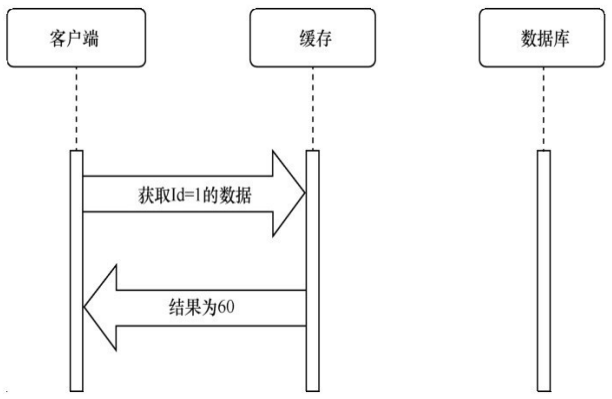

# 缓存

## 缓存的概念

### 基本概念

**缓存**（caching）是系统优化中简单⼜有效的⼯具，只要简单⼏⾏代码或者⼏个简单的配置，我们就可以利⽤缓存让系统的性能得到极⼤的提升。本节将会对响应缓存、内存缓存、分布式缓存分别进⾏讲解。

缓存是⼀个⽤来保存数据的区域，从缓存区域中读取数据的速度⽐从数据源读取数据的速度快很多。在从数据源（如数据库）获取数据之后，我们可以把数据保存到缓存中。下次再需要获取同样数据的时候，我们可以直接从缓存中获取之前保存的数据，⽽不需要再去数据源获取数据

补充几个概念

**缓存命中：** 从缓存中获取了要获取的数据

**命中率：** 命中的请求占全部请求的百分率

**缓存数据不一致：** 数据源中的数据保存到缓存后，数据源发生变化

### 多级缓存

在Web开发中，存在着多级缓存，⽐如在浏览器端存在 **“浏览器端缓存”**，在⽹关节点服务器中也可能存在 **“节点缓存”**，在Web服务器上也可能存在 **“服务器端缓存”**，对于⽤户发出的请求，只要在任何⼀个节点上命中缓存，请求就会直接返回，⽽不会继续向后传递。

### RFC 7234

**基本概念**

HTTP中的RFC 7234规范中对缓存处理进⾏了规定，如果客户端（浏览器、App、物联⽹终端等）、CDN节点、API⽹关节点服务器、反向代理服务器、Web服务器等遵守这个规范，它们就会按照缓存相关的报⽂头中的设置对缓存进⾏控制。

ASP.NET Core中的响应缓存（response caching）就是遵守RFC 7234规范的缓存控制机制，它可以对浏览器缓存、CDN节点缓存、服务器端缓存进⾏统⼀的控制。

RFC 7234规范对缓存的控制有⼀定的局限性，因此有时候我们需要进⾏更加个性化的服务器端缓存控制。ASP.NET Core不仅提供了把Web服务器的内存⽤作缓存的内存缓存（in-memory cache），还提供了把Redis、数据库等⽤作缓存的分布式缓存（distributed cache）。

**控制指令**

在 HTTP 头中，`Cache-Control` 是主要的控制字段，用于指定缓存策略，常见指令包括：

- `max-age`: 指定响应在多少秒内可以缓存。
- `no-cache`: 需要重新验证资源的有效性，而不是直接使用缓存。
- `no-store`: 指示缓存不要存储请求或响应。
- `public` 和 `private`: `public` 表示响应可被共享缓存，`private` 则仅限于单个用户缓存。

**过期和重新验证**

RFC 7234 提供了多种方法判断缓存是否过期：

- **Expires**: 指定一个绝对的时间点，缓存超过该时间点后失效。
- **ETag 和 Last-Modified**: 通过实体标签（ETag）和最后修改时间（Last-Modified）来进行缓存重新验证。

客户端可在请求中带上缓存标识头部字段（如 `If-None-Match` 和 `If-Modified-Since`），以询问服务器资源是否更新。

**条件请求**

条件请求允许客户端基于缓存的状态请求资源。常见的条件请求头包括：

- `If-Modified-Since`: 仅当资源在指定时间后修改过才返回资源。
- `If-None-Match`: 仅当 ETag 不匹配时返回资源。

**可缓存性**

RFC 7234 定义了哪些 HTTP 方法和响应状态代码可缓存：

- **可缓存方法**：`GET`、`HEAD` 通常可缓存，而 `POST`、`PUT` 和 `DELETE` 不可缓存。
- **可缓存状态码**：如 `200 OK`、`203 Non-Authoritative Information`、`204 No Content`、`206 Partial Content` 等。

## 客户端响应缓存

### 简介

RFC 7234是HTTP中对缓存进⾏控制的规范，其中重要的是cache-control响应报⽂头。

假如浏览器向服务器请求/Person/1这个路径，如果服务器端给浏览器端的响应报⽂头中cache-control的值为max-age=60，则表⽰服务器指⽰浏览器端“可以缓存这个响应内容60s”。

在60s内，如果⽤户要求浏览器再次向/Person/1发送请求的话，浏览器就可以直接使⽤保存的缓存内容，⽽不是向服务器再次发出请求。

### 测试带缓存的方法

在ASP.NET Core中，我们⼀般不需要⼿动控制响应报⽂头中的cache-control，只要给需要进⾏缓存控制的控制器的操作⽅法添加ResponseCacheAttribute 这 个 Attribute 即 可 ， ASP.NET Core 会根 据ResponseCacheAttribute的设置来⽣成合适的cache-control响应报⽂头。

下⾯编写程序验证⼀下。

~~~csharp
[Route("api/[controller]/[action]")]
[ApiController]
public class TestCacheController : ControllerBase
{

    [HttpGet]
    [ResponseCache(Duration = 60)]
    public DateTime Now()
    {
        return DateTime.Now;
    }

    [HttpGet]
    //[ResponseCache(Duration = 60)]
    public DateTime NowNoCache()
    {
        return DateTime.Now;
    }

}
~~~

Swagger-ui 调试，并打开 network 监控

一分钟内多次请求，会读取缓存

等一分钟后再请求，会从后端重新获取

## 服务端响应缓存

### 简介

如果我们在ASP.NET Core中安装了“响应缓存中间件”（response caching middleware），ASP.NET Core不仅会继续根据 `[ResponseCache]` 设置来⽣成 `cache-control` 响应报⽂头以设置客户端缓存，还会在服务器端也按照 `[ResponseCache]` 的设置来对响应进⾏服务器端缓存。

如果没有启⽤“响应缓存中间件”，那么当A、B、C这3个浏览器分别向/Test1/Now路径发送请求的时候，服务器端的Now⽅法会执⾏3次；

如果启⽤了“响应缓存中间件”，当A、B、C这3个浏览器分别向/Test1/Now路径发送请求的时候，只要后⾯两次请求的时间在60s内，服务器端的Now⽅法只会执⾏1次，后两次请求虽然也会到达服务器，但是服务器会把第1次响应的缓存内容直接返回，⽽不会执⾏Now⽅法。

很显然，使⽤响应缓存中间件在服务器端实现响应缓存有两个好处：

- 第⼀，提升没有实现缓存机制的客户端获取数据的速度，因为虽然请求仍然到达了服务器，但服务器端缓存直接返回了缓存的响应，避免了从执⾏速度缓慢的数据源获取数据的性能问题；
- 第⼆，对于实现了缓存机制的客户端也能降低服务器端的压⼒，因为如果没有启⽤响应缓存中间件，那么如果在短时间内服务器端收到了来⾃⼀万个不同客户端到/Test1/Now的请求，那么Now⽅法仍然会执⾏⼀万次，因为客户端的缓存是由每个客户端⾃⼰管理的；如果启⽤了响应缓存中间件，Now⽅法只会执⾏⼀次，这降低了服务器端的压⼒。

### 测试

启⽤响应缓存中间件的步骤很简单，除了给控制器中需要进⾏缓存控制的操作⽅法标注 `[ResponseCache]` 之外，
我们只要在ASP.NETCore 项 ⽬ 的 `Program.cs` 的 ` app.MapControllers ` 之前加上 ` app.UseResponseCaching ` 即可

！注意，如果项 ⽬ 启 ⽤ 了 CORS ，请确保 `app.UseCors` 写到 `app.UseResponseCaching` 之前。

**Postman 测试**

Postman默认是忽略RFC 7234规范的（写文章的时候是这样的，如果有更改自行搜索方法解决）

好了已经不忽略了，需要在设置里想办法把 header 中的 Cache-Control: no-cache 去掉

测试得到的结果：即使客户端不做缓存，服务端也会将请求缓存

此时用 swagger ui 立刻请求，也是读得的服务端缓存的结果

## ImemoryCache 接口

`IMemoryCache` 接口是 .NET Core 中提供的一种内存缓存机制，通常用于在应用程序的生命周期内临时存储数据，从而提高性能、减少数据库查询或 API 请求。使用 `IMemoryCache` 可以方便地在内存中存储和检索数据，而无需依赖外部缓存服务。

### 常用方法和属性

**`TryGetValue`**

- 用于检查缓存中是否存在指定的键，并返回对应的值。
  
- **方法签名**：`bool TryGetValue(object key, out object value);`
  
- **示例**：
~~~csharp
if (cache.TryGetValue("myKey", out var value))
{
    Console.WriteLine($"Cached value: {value}");
}
~~~

**`CreateEntry`**

- 创建或更新缓存条目，通过指定键和项的生命周期控制缓存存储。
  
- **方法签名**：`ICacheEntry CreateEntry(object key);`
  
- **示例**：
~~~csharp
using (var cacheEntry = cache.CreateEntry("myKey"))
{
    cacheEntry.Value = "myValue";
    cacheEntry.AbsoluteExpirationRelativeToNow = TimeSpan.FromMinutes(5); // 设置缓存有效期
}
~~~

**`Set`**

- 直接将指定的键值对放入缓存，并可以设置缓存项的过期策略。
  
- **方法签名**：`TItem Set<TItem>(object key, TItem value, MemoryCacheEntryOptions options);`
  
- **示例**：
~~~csharp
cache.Set("myKey", "myValue", TimeSpan.FromMinutes(5));
~~~

**`Remove`**

- 从缓存中移除指定的键。
  
- **方法签名**：`void Remove(object key);`
  
- **示例**：
~~~csharp
cache.Remove("myKey");
~~~

**`GetOrCreateAsync`**

- 以异步方式从缓存中获取数据，如果缓存中不存在对应的项，则自动创建该项并缓存。
  
- **方法签名**：`public Task<TItem> GetOrCreateAsync<TItem>( object key, Func<ICacheEntry, Task<TItem>> factory);`
- **`key`**: 缓存项的唯一标识符（键）。
- **`factory`**: 一个异步工厂方法，接受一个 `ICacheEntry` 参数并返回要缓存的值。这个方法在缓存中没有找到对应项时会被调用。
  
- **示例**：
~~~csharp
public class MyService
{
    private readonly IMemoryCache _cache;

    public MyService(IMemoryCache cache)
    {
        _cache = cache;
    }

    public async Task<string> GetOrCreateDataAsync(string key)
    {
        return await _cache.GetOrCreateAsync(key, async entry =>
        {
            // 设置缓存项的过期策略
            entry.AbsoluteExpirationRelativeToNow = TimeSpan.FromMinutes(10);
            
            // 模拟从数据源异步获取数据
            var data = await GetDataFromDataSourceAsync();
            return data;
        });
    }

    private async Task<string> GetDataFromDataSourceAsync()
    {
        // 模拟延迟
        await Task.Delay(1000);
        return "Data from source";
    }
}
~~~

常用于从数据库获取数据的缓存

### 缓存过期策略

在 `IMemoryCache` 中，可以通过 `MemoryCacheEntryOptions` 来定义缓存项的过期策略：

- **Absolute Expiration**：指定缓存项的绝对过期时间，到达该时间后缓存项失效。
~~~csharp
cache.Set("myKey", "myValue", new MemoryCacheEntryOptions
{
    AbsoluteExpirationRelativeToNow = TimeSpan.FromMinutes(5)
});
~~~

- **Sliding Expiration**：设置滑动过期时间，在每次访问缓存项时刷新过期时间。
~~~csharp
cache.Set("myKey", "myValue", new MemoryCacheEntryOptions
{
    SlidingExpiration = TimeSpan.FromMinutes(2)
});
~~~

## 缓存穿透

缓存穿透：请求的数据在数据库不存在，所以无法命中缓存，每一次都要向数据库请求；此时如果有恶意请求，频繁请求不存在的数据，就会造成缓存穿透

解决方法：给不存在的数据也写入缓存

存在缓存穿透风险的程序
~~~csharp
public async Task<ActionResult<Book?>> Demo5(Guid id)
{
    string cacheKey = "Book" + id; // 缓存键
    Book? b = memCache.Get<Book?>(cacheKey);
    
    if (b == null) // 如果缓存中没有数据
    {
        // 查询数据库，然后写入缓存
        b = await dbCtx.Books.FindAsync(id);
        memCache.Set(cacheKey, b);
    }

    if (b == null) // 如果仍然没找到数据
        return NotFound("找不到这本书");
    else
        return b;
}
~~~

解决缓存穿透问题的程序

~~~csharp
logger.LogInformation("开始执行Demo5");
string cacheKey = "Book" + id;

var book = await memCache.GetOrCreateAsync(cacheKey, async (e) =>
{
    var b = await dbCtx.Books.FindAsync(id);
    logger.LogInformation("数据库查询：{0}", b == null ? "为空" : "不为空");
    return b;
});

logger.LogInformation("Demo5执行结束：{0}", book == null ? "为空" : "不为空");
return book;

~~~

## 缓存雪崩

使用缓存的时候，服务端有时会出现在短时间把一大批数据加入缓存的情况，到了过期时间这些缓存又会集中过期，给服务器带来周期性的陡增的压力。

**解决方法：** 写入缓存时给缓存一个随机的时间

## 自己封装一个缓存类

~~~csharp
public interface IMemoryCacheHelper
{
    TResult? GetOrCreate<TResult>(
        string cacheKey,
        Func<ICacheEntry, TResult?> valueFactory,
        int expireSeconds = 60);
        
    Task<TResult?> GetOrCreateAsync<TResult>(
        string cacheKey,
        Func<ICacheEntry, Task<TResult?>> valueFactory,
        int expireSeconds = 60);
        
    void Remove(string cacheKey);
}
~~~

~~~csharp
public class MemoryCacheHelper : IMemoryCacheHelper
{
    private readonly IMemoryCache memoryCache;

    public MemoryCacheHelper(IMemoryCache memoryCache)
    {
        this.memoryCache = memoryCache;
    }

    private static void ValidateValueType<TResult>()
    {
        Type typeResult = typeof(TResult);
        if (typeResult.IsGenericType) // 如果是泛型类型，获取泛型类型定义
        {
            typeResult = typeResult.GetGenericTypeDefinition();
        }
        
        if (typeResult == typeof(IEnumerable<>) || 
            typeResult == typeof(IEnumerable) ||
            typeResult == typeof(IAsyncEnumerable<TResult>) ||
            typeResult == typeof(IQueryable<TResult>) || 
            typeResult == typeof(IQueryable))
        {
            throw new InvalidOperationException("please use List<T> or T[] instead.");
        }
    }

    private static void InitCacheEntry(ICacheEntry entry, int baseExpireSeconds)
    {
        double sec = Random.Shared.Next(baseExpireSeconds, baseExpireSeconds * 2);
        TimeSpan expiration = TimeSpan.FromSeconds(sec);
        entry.AbsoluteExpirationRelativeToNow = expiration;
    }

    public async Task<TResult?> GetOrCreateAsync<TResult>(
        string cacheKey,
        Func<ICacheEntry, Task<TResult?>> valueFactory,
        int baseExpireSeconds = 60)
    {
        ValidateValueType<TResult>();
        
        if (!memoryCache.TryGetValue(cacheKey, out TResult result))
        {
            using ICacheEntry entry = memoryCache.CreateEntry(cacheKey);
            InitCacheEntry(entry, baseExpireSeconds);
            result = await valueFactory(entry);
            entry.Value = result;
        }
        
        return result;
    }
}

~~~

- **MemoryCacheHelper 类**：实现了 `IMemoryCacheHelper` 接口，提供内存缓存的具体实现。
- **构造函数**：接受一个 `IMemoryCache` 实例并进行初始化。
- **ValidateValueType 方法**：验证缓存值的类型，防止使用不支持的类型（如 `IEnumerable` 和 `IQueryable`）。
- **InitCacheEntry 方法**：初始化缓存条目的过期时间，使用随机值来增加不确定性。
- **GetOrCreateAsync 方法**：异步获取或创建缓存。尝试从缓存中获取值，如果不存在，则使用 `valueFactory` 方法生成新值并存入缓存。