# .Net Core 6

**本文章的目的是对于有基础的程序员快速上手.Net 6**

推荐优先学习c#语法与.NET 特性

ASP.NET特性：

[NET特性](https://www.cnblogs.com/JohnTang/category/1387684.html)

本文章不推荐0基础阅读
## 第一个ASP.NET MVC程序

Step1：建一个ASP.NET MVC程序，添加一个控制器

~~~c#
using Microsoft.AspNetCore.Mvc;

namespace Advanced.NET.Controllers
{
    public class FirstController : Controller
    {
        public IActionResult Index()
        {
            ViewBag.User1 = "张三";
            ViewBag.User2 = "李四";
            TempData["User3"] = "王五";
            HttpContext.Session.SetString("User4", "赵六");
            object User5 = "田七";
            return View(User5);
        }
    }
}

~~~

此处右键Index可以选择创建视图

然后再创建一个视图

~~~html
@*
    For more information on enabling MVC for empty projects, visit https://go.microsoft.com/fwlink/?LinkID=397860
*@
@{
    // ViewBag["Title"] = "Index";
}
<h1>Index Hello</h1>
<h2>User1 = @ViewBag.User1</h2>
<h2>User2 = @ViewData["User2"]</h2>
<h2>User3 = @TempData["User3"]</h2>
<h2>User4 = @Context.Session.GetString("User4")</h2>
<h2>User5 = @Model</h2>
<h2>User6 = </h2>
~~~

在启动项配置中加入Session，因为上面有一个用Session的

~~~c#
var builder = WebApplication.CreateBuilder(args);

// Add services to the container.
builder.Services.AddControllersWithViews();
{
    builder.Services.AddSession();
}

var app = builder.Build();

// Configure the HTTP request pipeline.
if (!app.Environment.IsDevelopment())
{
    app.UseExceptionHandler("/Home/Error");
    // The default HSTS value is 30 days. You may want to change this for production scenarios, see https://aka.ms/aspnetcore-hsts.
    app.UseHsts();
}

app.UseSession();

app.UseHttpsRedirection();

app.UseStaticFiles();

app.UseRouting();

app.UseAuthorization();

app.MapControllerRoute(
    name: "default",
    pattern: "{controller=Home}/{action=Index}/{id?}");

app.Run();

~~~

运行即可

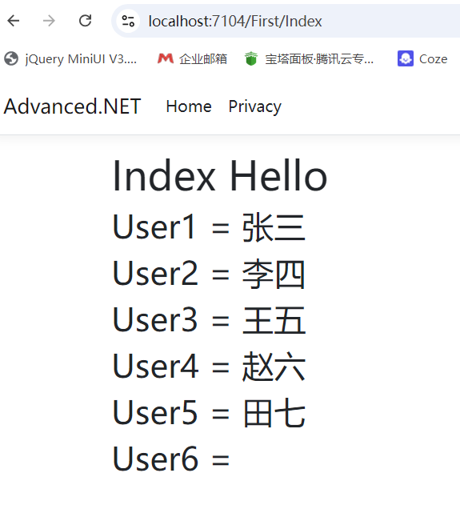


## Nuget程序包

安装以及管理依赖所用

下面以安装log4net为例

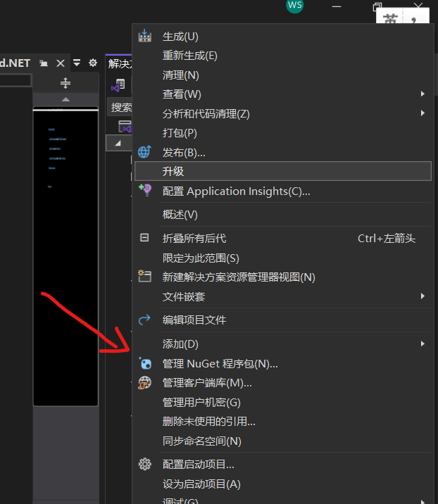


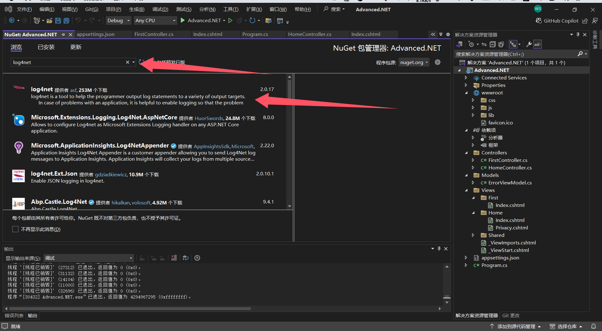

## 引入log4net

### step1: 安装依赖 

略
//Nuget引入log4net和Microsoft.Extensions.Logging.Log4Net.AspNetCore

### step2: 导入配置文件

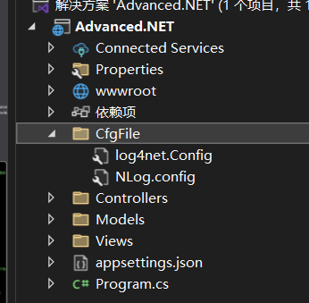

log4net.config

~~~xml
<?xml version="1.0" encoding="utf-8"?>
<log4net>
	<!-- Define some output appenders -->
	<appender name="rollingAppender" type="log4net.Appender.RollingFileAppender">
		<file value="log4\log.txt" />
		<!--追加日志内容-->
		<appendToFile value="true" />

		<!--防止多线程时不能写Log,官方说线程非安全-->
		<lockingModel type="log4net.Appender.FileAppender+MinimalLock" />

		<!--可以为:Once|Size|Date|Composite-->
		<!--Composite为Size和Date的组合-->
		<rollingStyle value="Composite" />

		<!--当备份文件时,为文件名加的后缀-->
		<datePattern value="yyyyMMdd.TXT" />

		<!--日志最大个数,都是最新的-->
		<!--rollingStyle节点为Size时,只能有value个日志-->
		<!--rollingStyle节点为Composite时,每天有value个日志-->
		<maxSizeRollBackups value="20" />

		<!--可用的单位:KB|MB|GB-->
		<maximumFileSize value="3MB" />

		<!--置为true,当前最新日志文件名永远为file节中的名字-->
		<staticLogFileName value="true" />

		<!--输出级别在INFO和ERROR之间的日志-->
		<filter type="log4net.Filter.LevelRangeFilter">
			<param name="LevelMin" value="ALL" />
			<param name="LevelMax" value="FATAL" />
		</filter>
		<layout type="log4net.Layout.PatternLayout">
			<conversionPattern value="%date [%thread] %-5level %logger - %message%newline"/>
		</layout>
	</appender>

	<!--SqlServer形式-->
	<!--log4net日志配置：http://logging.apache.org/log4net/release/config-examples.html -->
	<appender name="AdoNetAppender_SqlServer" type="log4net.Appender.AdoNetAppender">
		<!--日志缓存写入条数 设置为0时只要有一条就立刻写到数据库-->
		<bufferSize value="0" />
		<connectionType value="System.Data.SqlClient.SqlConnection,System.Data.SqlClient, Version=4.6.1.3, Culture=neutral, PublicKeyToken=b03f5f7f11d50a3a" />
		<connectionString value="Data Source=DESKTOP-T2D6ILD;Initial Catalog=LogManager;Persist Security Info=True;User ID=sa;Password=sa123" />
		<commandText value="INSERT INTO Log4Net ([Date],[Thread],[Level],[Logger],[Message],[Exception]) VALUES (@log_date, @thread, @log_level, @logger, @message, @exception)" />
		<parameter>
			<parameterName value="@log_date" />
			<dbType value="DateTime" />
			<layout type="log4net.Layout.RawTimeStampLayout" />
		</parameter>
		<parameter>
			<parameterName value="@thread" />
			<dbType value="String" />
			<size value="255" />
			<layout type="log4net.Layout.PatternLayout">
				<conversionPattern value="%thread" />
			</layout>
		</parameter>
		<parameter>
			<parameterName value="@log_level" />
			<dbType value="String" />
			<size value="50" />
			<layout type="log4net.Layout.PatternLayout">
				<conversionPattern value="%level" />
			</layout>
		</parameter>
		<parameter>
			<parameterName value="@logger" />
			<dbType value="String" />
			<size value="255" />
			<layout type="log4net.Layout.PatternLayout">
				<conversionPattern value="%logger" />
			</layout>
		</parameter>
		<parameter>
			<parameterName value="@message" />
			<dbType value="String" />
			<size value="4000" />
			<layout type="log4net.Layout.PatternLayout">
				<conversionPattern value="%message" />
			</layout>
		</parameter>
		<parameter>
			<parameterName value="@exception" />
			<dbType value="String" />
			<size value="2000" />
			<layout type="log4net.Layout.ExceptionLayout" />
		</parameter>
	</appender>
	
	<root>

		<!--控制级别，由低到高: ALL|DEBUG|INFO|WARN|ERROR|FATAL|OFF-->
		<!--OFF:0-->
		<!--FATAL:FATAL-->
		<!--ERROR: ERROR,FATAL-->
		<!--WARN: WARN,ERROR,FATAL-->
		<!--INFO: INFO,WARN,ERROR,FATAL-->
		<!--DEBUG: INFO,WARN,ERROR,FATAL-->
		<!--ALL: DEBUG,INFO,WARN,ERROR,FATAL--> 
		<priority value="ALL"/>
		
		<level value="INFO"/>
		<appender-ref ref="rollingAppender" />
		<appender-ref ref="AdoNetAppender_SqlServer" />
	</root>
</log4net>

~~~


NLog.config

~~~xml
<?xml version="1.0" encoding="utf-8" ?>
<nlog xmlns="http://www.nlog-project.org/schemas/NLog.xsd"
      xmlns:xsi="http://www.w3.org/2001/XMLSchema-instance"
      xsi:schemaLocation="http://www.nlog-project.org/schemas/NLog.xsd NLog.xsd"
      autoReload="true"
      throwExceptions="false"
      internalLogLevel="Off" internalLogFile="c:\temp\nlog-internal.log">

  <!-- optional, add some variables
  https://github.com/nlog/NLog/wiki/Configuration-file#variables
  -->
  <variable name="myvar" value="myvalue"/>

  <!--
  See https://github.com/nlog/nlog/wiki/Configuration-file
  for information on customizing logging rules and outputs.
   -->
  <targets> 
    <!--
    add your targets here
    See https://github.com/nlog/NLog/wiki/Targets for possible targets.
    See https://github.com/nlog/NLog/wiki/Layout-Renderers for the possible layout renderers.
    --> 
    <target name="AllDatabase" xsi:type="Database"
          dbProvider="System.Data.SqlClient.SqlConnection, System.Data.SqlClient"
          connectionString="Data Source=DESKTOP-T2D6ILD;Initial Catalog=LogManager;Persist Security Info=True;User ID=sa;Password=sa123"
          commandText="insert into dbo.NLog (Application, Logged, Level, Message,Logger, CallSite, Exception) values (@Application, @Logged, @Level, @Message,@Logger, @Callsite, @Exception);">
              <parameter name="@application" layout="AspNetCoreNlog" />
              <parameter name="@logged" layout="${date}" />
              <parameter name="@level" layout="${level}" />
              <parameter name="@message" layout="${message}" />
              <parameter name="@logger" layout="${logger}" />
              <parameter name="@callSite" layout="${callsite:filename=true}" />
              <parameter name="@exception" layout="${exception:tostring}" />
    </target>
     
    <target xsi:type="File" name="allfile" fileName="NLog\nlog-all-${shortdate}.log"
            layout="${longdate}|${logger}|${uppercase:${level}}|${message} ${exception}" />
    <!--同样是将文件写入日志中，写入的内容有所差别，差别在layout属性中体现。写入日志的数量有差别，差别在路由逻辑中体现-->
    <target xsi:type="File" name="ownFile-web" fileName="NLog\nlog-my-${shortdate}.log"
             layout="${longdate}|${logger}|${uppercase:${level}}|${message} ${exception}" />
    <target xsi:type="Null" name="blackhole" />
    <!--
    Write events to a file with the date in the filename.
    <target xsi:type="File" name="f" fileName="${basedir}/logs/${shortdate}.log"
            layout="${longdate} ${uppercase:${level}} ${message}" />
    -->
  </targets>

  <rules> 
    <logger name="*" minlevel="Trace" writeTo="AllDatabase" /> 
    <!-- add your logging rules here --> 
    <!--路由顺序会对日志打印产生影响。路由匹配逻辑为顺序匹配。-->
    <!--All logs, including from Microsoft-->
    <logger name="*" minlevel="Trace" writeTo="allfile" /> 
    <!--Skip Microsoft logs and so log only own logs-->
    <!--以Microsoft打头的日志将进入此路由，由于此路由没有writeTo属性，所有会被忽略-->
    <!--且此路由设置了final，所以当此路由被匹配到时。不会再匹配此路由下面的路由。未匹配到此路由时才会继续匹配下一个路由-->
    <logger name="Microsoft.*" minlevel="Trace"  final="true" />
    <!--上方已经过滤了所有Microsoft.*的日志，所以此处的日志只会打印除Microsoft.*外的日志-->
    <logger name="*" minlevel="Trace" writeTo="ownFile-web" /> 
    <!--
    Write all events with minimal level of Debug (So Debug, Info, Warn, Error and Fatal, but not Trace)  to "f"
    <logger name="*" minlevel="Debug" writeTo="f" />
    -->
  </rules>
</nlog>

~~~

### step3: 导入启动项与配置

Program.cs

~~~c#

    //Nuget引入log4net和Microsoft.Extensions.Logging.Log4Net.AspNetCore
    builder.Logging.AddLog4Net("CfgFile/log4net.Config");

~~~

这里如果配置文件

### step4: 调用并测试

注入得到log4net实例并写日志

新建一个控制器 调用log4net 测试

~~~c#
using Microsoft.AspNetCore.Mvc;

namespace Advanced.NET.Controllers
{
    public class Log4NetController : Controller
    {
        private readonly ILogger<Log4NetController> _Logger;
        private readonly ILoggerFactory _loggerFactory;
        public Log4NetController(ILogger<Log4NetController> logger, ILoggerFactory loggerFactory)
        {
            _Logger = logger;
            this._Logger.LogInformation($"{this.GetType().Name}被执行了");
            _loggerFactory = loggerFactory;
            ILogger<Log4NetController> _logger2 = this._loggerFactory.CreateLogger<Log4NetController>();
            _logger2.LogInformation($"{this.GetType().Name}被执行了");
        }

        public IActionResult Index()
        {
            return View();
        }
    }
}

~~~


运行测试

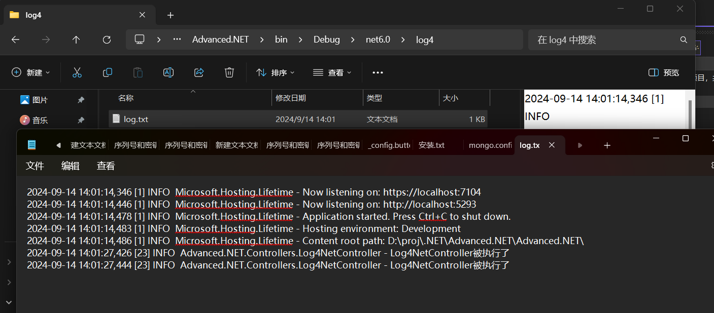

##  Log4Net写SQL Server

### Step1:Nuget引入程序包

~~~c#
System.Data.SqlClient
~~~

### Step2:修改配置文件：支持写数据库

log4net.Config

sqlserver 配置部分  注意需要建表，且与配置中的Insert语句对应，可自定义  记得改数据库连接信息

~~~xml
<!--SqlServer形式-->
<!--log4net日志配置：http://logging.apache.org/log4net/release/config-examples.html -->
<appender name="AdoNetAppender_SqlServer" type="log4net.Appender.AdoNetAppender">
	<!--日志缓存写入条数 设置为0时只要有一条就立刻写到数据库-->
	<bufferSize value="0" />
	<connectionType value="System.Data.SqlClient.SqlConnection,System.Data.SqlClient, Version=4.6.1.3, Culture=neutral, PublicKeyToken=b03f5f7f11d50a3a" />
	<connectionString value="Data Source=DESKTOP-T2D6ILD;Initial Catalog=LogManager;Persist Security Info=True;User ID=sa;Password=sa123" />
	<commandText value="INSERT INTO Log4Net ([Date],[Thread],[Level],[Logger],[Message],[Exception]) VALUES (@log_date, @thread, @log_level, @logger, @message, @exception)" />
	<parameter>
		<parameterName value="@log_date" />
		<dbType value="DateTime" />
		<layout type="log4net.Layout.RawTimeStampLayout" />
	</parameter>
	<parameter>
		<parameterName value="@thread" />
		<dbType value="String" />
		<size value="255" />
		<layout type="log4net.Layout.PatternLayout">
			<conversionPattern value="%thread" />
		</layout>
	</parameter>
	<parameter>
		<parameterName value="@log_level" />
		<dbType value="String" />
		<size value="50" />
		<layout type="log4net.Layout.PatternLayout">
			<conversionPattern value="%level" />
		</layout>
	</parameter>
	<parameter>
		<parameterName value="@logger" />
		<dbType value="String" />
		<size value="255" />
		<layout type="log4net.Layout.PatternLayout">
			<conversionPattern value="%logger" />
		</layout>
	</parameter>
	<parameter>
		<parameterName value="@message" />
		<dbType value="String" />
		<size value="4000" />
		<layout type="log4net.Layout.PatternLayout">
			<conversionPattern value="%message" />
		</layout>
	</parameter>
	<parameter>
		<parameterName value="@exception" />
		<dbType value="String" />
		<size value="2000" />
		<layout type="log4net.Layout.ExceptionLayout" />
	</parameter>
</appender>
~~~

~~~xml
<root>

	<!--控制级别，由低到高: ALL|DEBUG|INFO|WARN|ERROR|FATAL|OFF-->
	<!--OFF:0-->
	<!--FATAL:FATAL-->
	<!--ERROR: ERROR,FATAL-->
	<!--WARN: WARN,ERROR,FATAL-->
	<!--INFO: INFO,WARN,ERROR,FATAL-->
	<!--DEBUG: INFO,WARN,ERROR,FATAL-->
	<!--ALL: DEBUG,INFO,WARN,ERROR,FATAL--> 
	<priority value="ALL"/>
	
	<level value="INFO"/>
	<appender-ref ref="rollingAppender" />
	<appender-ref ref="AdoNetAppender_SqlServer" />
</root>
~~~

完整文件（既输出本地文件日志，又输出数据库日志）

~~~xml
<?xml version="1.0" encoding="utf-8"?>
<log4net>
	<!-- Define some output appenders -->
	<appender name="rollingAppender" type="log4net.Appender.RollingFileAppender">
		<file value="log4\log.txt" />
		<!--追加日志内容-->
		<appendToFile value="true" />

		<!--防止多线程时不能写Log,官方说线程非安全-->
		<lockingModel type="log4net.Appender.FileAppender+MinimalLock" />

		<!--可以为:Once|Size|Date|Composite-->
		<!--Composite为Size和Date的组合-->
		<rollingStyle value="Composite" />

		<!--当备份文件时,为文件名加的后缀-->
		<datePattern value="yyyyMMdd.TXT" />

		<!--日志最大个数,都是最新的-->
		<!--rollingStyle节点为Size时,只能有value个日志-->
		<!--rollingStyle节点为Composite时,每天有value个日志-->
		<maxSizeRollBackups value="20" />

		<!--可用的单位:KB|MB|GB-->
		<maximumFileSize value="3MB" />

		<!--置为true,当前最新日志文件名永远为file节中的名字-->
		<staticLogFileName value="true" />

		<!--输出级别在INFO和ERROR之间的日志-->
		<filter type="log4net.Filter.LevelRangeFilter">
			<param name="LevelMin" value="ALL" />
			<param name="LevelMax" value="FATAL" />
		</filter>
		<layout type="log4net.Layout.PatternLayout">
			<conversionPattern value="%date [%thread] %-5level %logger - %message%newline"/>
		</layout>
	</appender>

	<!--SqlServer形式-->
	<!--log4net日志配置：http://logging.apache.org/log4net/release/config-examples.html -->
	<appender name="AdoNetAppender_SqlServer" type="log4net.Appender.AdoNetAppender">
		<!--日志缓存写入条数 设置为0时只要有一条就立刻写到数据库-->
		<bufferSize value="0" />
		<connectionType value="System.Data.SqlClient.SqlConnection,System.Data.SqlClient, Version=4.6.1.3, Culture=neutral, PublicKeyToken=b03f5f7f11d50a3a" />
		<connectionString value="Data Source=DESKTOP-T2D6ILD;Initial Catalog=LogManager;Persist Security Info=True;User ID=sa;Password=sa123" />
		<commandText value="INSERT INTO Log4Net ([Date],[Thread],[Level],[Logger],[Message],[Exception]) VALUES (@log_date, @thread, @log_level, @logger, @message, @exception)" />
		<parameter>
			<parameterName value="@log_date" />
			<dbType value="DateTime" />
			<layout type="log4net.Layout.RawTimeStampLayout" />
		</parameter>
		<parameter>
			<parameterName value="@thread" />
			<dbType value="String" />
			<size value="255" />
			<layout type="log4net.Layout.PatternLayout">
				<conversionPattern value="%thread" />
			</layout>
		</parameter>
		<parameter>
			<parameterName value="@log_level" />
			<dbType value="String" />
			<size value="50" />
			<layout type="log4net.Layout.PatternLayout">
				<conversionPattern value="%level" />
			</layout>
		</parameter>
		<parameter>
			<parameterName value="@logger" />
			<dbType value="String" />
			<size value="255" />
			<layout type="log4net.Layout.PatternLayout">
				<conversionPattern value="%logger" />
			</layout>
		</parameter>
		<parameter>
			<parameterName value="@message" />
			<dbType value="String" />
			<size value="4000" />
			<layout type="log4net.Layout.PatternLayout">
				<conversionPattern value="%message" />
			</layout>
		</parameter>
		<parameter>
			<parameterName value="@exception" />
			<dbType value="String" />
			<size value="2000" />
			<layout type="log4net.Layout.ExceptionLayout" />
		</parameter>
	</appender>
	
	<root>

		<!--控制级别，由低到高: ALL|DEBUG|INFO|WARN|ERROR|FATAL|OFF-->
		<!--OFF:0-->
		<!--FATAL:FATAL-->
		<!--ERROR: ERROR,FATAL-->
		<!--WARN: WARN,ERROR,FATAL-->
		<!--INFO: INFO,WARN,ERROR,FATAL-->
		<!--DEBUG: INFO,WARN,ERROR,FATAL-->
		<!--ALL: DEBUG,INFO,WARN,ERROR,FATAL--> 
		<priority value="ALL"/>
		
		<level value="INFO"/>
		<appender-ref ref="rollingAppender" />
		<appender-ref ref="AdoNetAppender_SqlServer" />
	</root>
</log4net>

~~~

### Step3:初始化数据库日志表

建表SQL如下

~~~sql
USE [master]
GO
 
/* 
  创建数据库LogManager
*/
CREATE DATABASE [LogManager];
 
 
GO
ALTER DATABASE [LogManager] SET COMPATIBILITY_LEVEL = 150
GO
IF (1 = FULLTEXTSERVICEPROPERTY('IsFullTextInstalled'))
begin
EXEC [LogManager].[dbo].[sp_fulltext_database] @action = 'enable'
end
GO
ALTER DATABASE [LogManager] SET ANSI_NULL_DEFAULT OFF 
GO
ALTER DATABASE [LogManager] SET ANSI_NULLS OFF 
GO
ALTER DATABASE [LogManager] SET ANSI_PADDING OFF 
GO
ALTER DATABASE [LogManager] SET ANSI_WARNINGS OFF 
GO
ALTER DATABASE [LogManager] SET ARITHABORT OFF 
GO
ALTER DATABASE [LogManager] SET AUTO_CLOSE OFF 
GO
ALTER DATABASE [LogManager] SET AUTO_SHRINK OFF 
GO
ALTER DATABASE [LogManager] SET AUTO_UPDATE_STATISTICS ON 
GO
ALTER DATABASE [LogManager] SET CURSOR_CLOSE_ON_COMMIT OFF 
GO
ALTER DATABASE [LogManager] SET CURSOR_DEFAULT  GLOBAL 
GO
ALTER DATABASE [LogManager] SET CONCAT_NULL_YIELDS_NULL OFF 
GO
ALTER DATABASE [LogManager] SET NUMERIC_ROUNDABORT OFF 
GO
ALTER DATABASE [LogManager] SET QUOTED_IDENTIFIER OFF 
GO
ALTER DATABASE [LogManager] SET RECURSIVE_TRIGGERS OFF 
GO
ALTER DATABASE [LogManager] SET  DISABLE_BROKER 
GO
ALTER DATABASE [LogManager] SET AUTO_UPDATE_STATISTICS_ASYNC OFF 
GO
ALTER DATABASE [LogManager] SET DATE_CORRELATION_OPTIMIZATION OFF 
GO
ALTER DATABASE [LogManager] SET TRUSTWORTHY OFF 
GO
ALTER DATABASE [LogManager] SET ALLOW_SNAPSHOT_ISOLATION OFF 
GO
ALTER DATABASE [LogManager] SET PARAMETERIZATION SIMPLE 
GO
ALTER DATABASE [LogManager] SET READ_COMMITTED_SNAPSHOT OFF 
GO
ALTER DATABASE [LogManager] SET HONOR_BROKER_PRIORITY OFF 
GO
ALTER DATABASE [LogManager] SET RECOVERY FULL 
GO
ALTER DATABASE [LogManager] SET  MULTI_USER 
GO
ALTER DATABASE [LogManager] SET PAGE_VERIFY CHECKSUM  
GO
ALTER DATABASE [LogManager] SET DB_CHAINING OFF 
GO
ALTER DATABASE [LogManager] SET FILESTREAM( NON_TRANSACTED_ACCESS = OFF ) 
GO
ALTER DATABASE [LogManager] SET TARGET_RECOVERY_TIME = 60 SECONDS 
GO
ALTER DATABASE [LogManager] SET DELAYED_DURABILITY = DISABLED 
GO
ALTER DATABASE [LogManager] SET ACCELERATED_DATABASE_RECOVERY = OFF  
GO
EXEC sys.sp_db_vardecimal_storage_format N'LogManager', N'ON'
GO
ALTER DATABASE [LogManager] SET QUERY_STORE = OFF
GO
USE [LogManager]
GO
/****** Object:  Table [dbo].[Log4Net]    Script Date: 2021/11/26 10:56:35 ******/
SET ANSI_NULLS ON
GO
SET QUOTED_IDENTIFIER ON
GO

/* 
  创建Log4net的表
*/

CREATE TABLE [dbo].[Log4Net](
	[Id] [int] IDENTITY(1,1) NOT NULL,
	[Date] [datetime] NOT NULL,
	[Thread] [varchar](255) NOT NULL,
	[Level] [varchar](50) NOT NULL,
	[Logger] [varchar](255) NOT NULL,
	[Message] [varchar](4000) NOT NULL,
	[Exception] [varchar](2000) NULL
) ON [PRIMARY]
GO
/****** Object:  Table [dbo].[NLog]    Script Date: 2021/11/26 10:56:35 ******/
SET ANSI_NULLS ON
GO
SET QUOTED_IDENTIFIER ON
GO


~~~


### Step4:注入写日志测试

测试成功

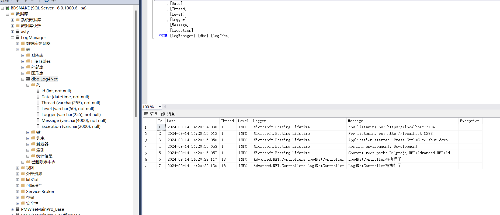


## ISS

### 安装配置

1、IIS安装

2、ASPNETCore 部署IIS 程序包安装

https://dotnet.microsoft.com/download/dotnet/6.0

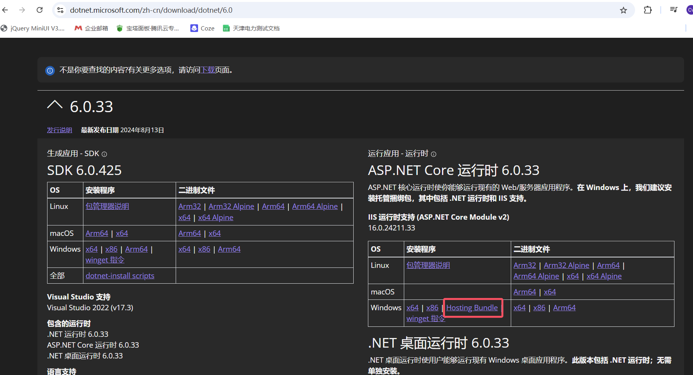

3、配置IIS


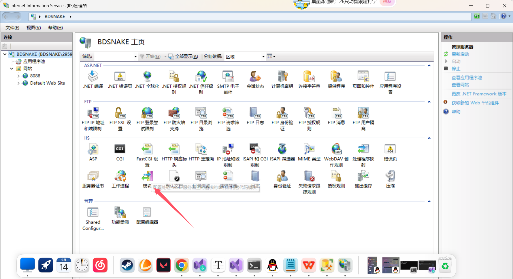

确保添加这个模块

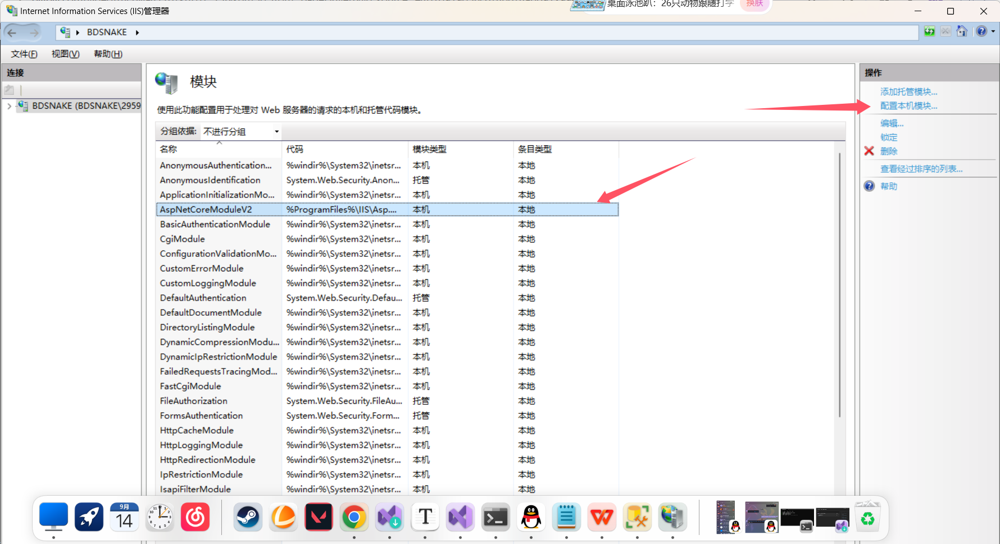

### 发布网站

Step1：发布项目

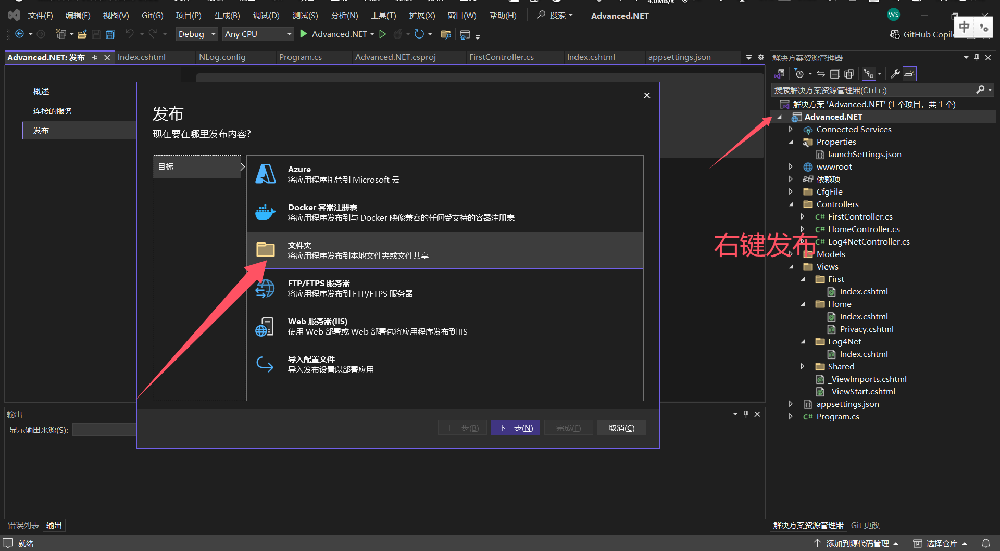

添加网站

图里路径不对，应该填发布的目录。填错了可点开在高级设置里改

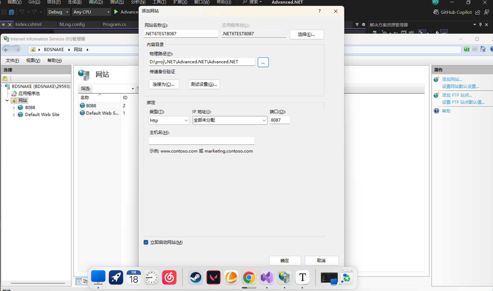

## AOP应用

参考博客：https://www.cnblogs.com/JohnTang

前言：带async的是异步版本，也是微软推荐使用的。
缓存、日志、返回结果封装只是这几个接口或类的常用功能，并不代表只能做这样的功能

- 授权过滤器（Authorization filters）
- 资源过滤器（Resource filters） 多用于缓存
- 操作过滤器（Action filters） 多用于日志
- 异常过滤器（Exception filters）
- 结果过滤器（Result filters） 多用于包装返回Json

### IResourceFilter

#### 接口介绍

IResourceFilter(资源缓存同步)

IResourceFilter扩展

  ASP.NET Core6提供的是接口IResourceFilter

  必须是自定义扩展 通过一个特性的支持

作用是做同步缓存

执行顺序

 A 先执行OnResourceExecuting(在xx资源之前)

 B 再执行构造函数

 C 执行Action

 D 最后执行OnResourceExecuted(在xx资源之后)

#### 实现

> **缓存构造步骤**
>
>    1定义一个缓存区域
>
>    2请求过来后进行判断，如果有缓存返回缓存里的值，如果没有缓存则进行处理
>
>    3把处理的结果加入缓存中
>
> 1定义特性类
>
> ​    名称以Attribute结尾(标记特性时可以省略),继承Attribute、IResourceFilter(并实现该接口)
>
>    public class CustomCacheResourceFilterAttribute : Attribute, IResourceFilter
>
> 2定义静态字典做缓存
>
> ​       private static Dictionary<string, object> _dictionary = new Dictionary<string, object>();
>
> 3 OnResourceExecuting(在xx资源之前)
>
> ​    如果缓存中有值，证明不是第一次，读取缓存中的值

简单实现:标记为Attribute 并实现IResourceFIlter接口


创建工具类设置缓存规则，这里以时间为例

~~~c#
using Microsoft.AspNetCore.Mvc.Filters;

namespace Advanced.NET.Utils
{
    public class CustomCacheResourceFilterAttribute : Attribute, IResourceFilter
    {
        //创建缓存字典
        private static Dictionary<string, object> CacheDictionary = new Dictionary<string, object>();
        //执行前
        public void OnResourceExecuting(ResourceExecutingContext context)
        {
            string cacheKey = context.HttpContext.Request.Path;
            if (CacheDictionary.ContainsKey(cacheKey))
            {
                context.Result = (Microsoft.AspNetCore.Mvc.IActionResult?)CacheDictionary[cacheKey];
            }
            //throw new NotImplementedException();
        }
        //执行后

        public void OnResourceExecuted(ResourceExecutedContext context)
        {
            string key = context.HttpContext.Request.Path;
            if (context.Result != null)
                CacheDictionary[key] = context.Result;
            //throw new NotImplementedException();
        }
    }
}

~~~

创建Controller与视图测试

~~~c#
using Advanced.NET.Utils;
using Microsoft.AspNetCore.Mvc;

namespace Advanced.NET.Controllers
{
    public class CacheResourceController : Controller
    {
        [CustomCacheResourceFilter]
        public IActionResult Index()
        {
            ViewBag.Date = DateTime.Now.ToString("yyyy-MM-dd HH:mm:ss");
            return View();
        }
    }
}

~~~

~~~html
@*
    For more information on enabling MVC for empty projects, visit https://go.microsoft.com/fwlink/?LinkID=397860
*@
@{
}

<h1>后端返回：@ViewBag.Date</h1>
<h2>实时获取：@DateTime.Now.ToString("yyyy-MM-dd HH:mm:ss")</h2>
~~~

### IAsyncResourceFilter

####  简介

IAsyncResourceFilter(资源缓存异步)

IAsyncResourceFilter扩展

  ASP.NET Core6提供的是接口IAsyncResourceFilter

  必须是自定义扩展 通过一个特性的支持

作用是做异步缓存

 

执行顺序

 实现的接口里有个委托参数，执行这个委托(就是执行构造方法和Action方法)，所以需要以这个委托执行为界限，可在之前或者之后添加

需要执行的。

#### 实现

**缓存构造步骤**

   1定义一个缓存区域

   2请求过来后进行判断，如果有缓存返回缓存里的值，如果没有缓存则进行处理

   3把处理的结果加入缓存中

 

> **实现**IAsyncResourceFilter
>
> 1定义特性类
>
> ​    名称以Attribute结尾(标记特性时可以省略),继承Attribute、IAsyncResourceFilter(并实现该接口)
>
> ​     public class CustomCacheAsyncResourceFilterAttribute : Attribute, IAsyncResourceFilter
>
> 2定义静态字典做缓存
>
> 3 判断缓存
>
>   判断缓存中是否有key，如果有将值取出值
>
>   如果没有值，则将值加入到缓存中去
>
> ​        //异步的时候,建设使用 async +await,
>
> ​        ResourceExecutedContext resource = await next.Invoke();//这句话的执行就是去执行控制器的构造函数+Action方法

**代码示例**

工具类

~~~c#
using Microsoft.AspNetCore.Mvc;
using Microsoft.AspNetCore.Mvc.Filters;

namespace Advanced.NET.Utils
{
    public class CustomCacheAsyncResourceFilterAttribute : Attribute, IAsyncResourceFilter
    {
        //1定义一个缓存区域
        //2请求过来后进行判断，如果有缓存返回缓存里的值，如果没有缓存则进行处理
        //3把处理的结果加入缓存中

        private static Dictionary<string, object> _dictionary = new Dictionary<string, object>();

        public async Task OnResourceExecutionAsync(ResourceExecutingContext context, ResourceExecutionDelegate next)
        {
            Console.WriteLine("CustomCacheAsyncResourceFilterAttribute.OnResourceExecutionAsync Before");

            string key = context.HttpContext.Request.Path;
            //在xx资源之前
            if (_dictionary.ContainsKey(key))
            {
                context.Result = (IActionResult)_dictionary[key];
            }
            else
            {
                //next是一个委托，执行委托Invoke();
                //查看委托的返回类型为Task<ResourceExecutedContext>
                // Task<ResourceExecutedContext> resource = next.Invoke();

                //异步的时候,建设使用 async +await,
                ResourceExecutedContext resource = await next.Invoke();//这句话的执行就是去执行控制器的构造函数+Action方法
                //在xx资源之后
                if (resource.Result != null)
                {
                    _dictionary[key] = resource.Result;
                }

            }
        }
    }
}

~~~

控制器

~~~c#
[CustomCacheAsyncResourceFilter]
public IActionResult Index1()
{
    {
        //此处是处理的业务逻辑，或返回的处理结果 省略..........
    }
    ViewBag.Date = DateTime.Now.ToString("yyyy-MM-dd HH:mm:ss");
    return View();
}
~~~

前端

~~~html
@*
    For more information on enabling MVC for empty projects, visit https://go.microsoft.com/fwlink/?LinkID=397860
*@
@{
    ViewData["Title"] = "Index2";
}

<h1>Index2</h1>
<h3>来自于控制器的计算结果：@ViewBag.Date</h3>
<h3>视图中实际计算的结果：@DateTime.Now.ToString("yyyy-MM-dd HH:mm:ss")</h3>
~~~

### IActionFilter

#### 简介

IAcIActionFilter(日志同步实现)

IActionFilter概念

  ASP.NET Core6提供的是接口IActionFilter/ActionFilterAttribute

系统框架提供的抽象（接口(同步实现和异步实现)/抽象类）,可以是自定义扩展，也可以直接使用

通过一个特性的支持

作用是做日志，更加贴合Action，缓存也能做，但是专人做专事，用它来做日志会更好

 

执行顺序

 A 先执行构造函数

 B 再执行OnActionExecuting(在xxAction之前)

 C 执行Action

 D 最后执行OnActionExecuted(在xxAction之后)

#### 实现

定义特性类

​    名称以Attribute结尾(标记特性时可以省略),继承Attribute、IActionFilter(并实现该接口)

   public class CustomIActionFilecuting(ActionExecutingContext context)  

这里的执行顺序会是在构造函数执行以后,Action执行之前执行

​      

 

3 OnActionExecuted(在xxAcion之后)

​    public void OnActionExecuted(ActionExecutedContext context)

这里的执行顺序会是在Action执行完毕以后执行

 

5 加入特性标记

  在需要做日志的方法上标记特性

**代码**

~~~c#
/// <summary>

    /// ActionFilter写入Log4net

    /// </summary>

    public class CustomIActionFilterAttribute : Attribute, IActionFilter

    {

 

 

        //构造函数注入1：创建只读私有私有属性

        private readonly ILogger<CustomIActionFilterAttribute> _logger;

 

        /// <summary>

        /// 构造函数赋值

        /// </summary>

        /// <param name="logger"></param>

        public CustomIActionFilterAttribute(ILogger<CustomIActionFilterAttribute> logger)

        {

 

            this._logger = logger;        

        }

 

        /// <summary>

        /// 在xxAction 之后

        /// </summary>

        /// <param name="context"></param>

        /// <exception cref="NotImplementedException"></exception>

        public void OnActionExecuted(ActionExecutedContext context)

        {

            Console.WriteLine("之后");

            var controllerName = context.HttpContext.GetRouteValue("controller");

            var actionName = context.HttpContext.GetRouteValue("action");

            var result = Newtonsoft.Json.JsonConvert.SerializeObject(context.Result);

            _logger.LogInformation($"执行{controllerName}控制器的{actionName}方法,结果是:{result}");

        }

 

        /// <summary>

        /// 在xxAction之前

        /// </summary>

        /// <param name="context"></param>

        /// <exception cref="NotImplementedException"></exception>

        public void OnActionExecuting(ActionExecutingContext context)

        {

            var para = context.HttpContext.Request.QueryString.Value;

            var controllerName = context.HttpContext.GetRouteValue("controller");

            var actionName = context.HttpContext.GetRouteValue("action");

            _logger.LogInformation($"执行{controllerName}控制器的{actionName}方法,参数是:{para}");

            Console.WriteLine("之前");

        }

    }
~~~

控制器

~~~c#
[TypeFilter(typeof(CustomIActionFilterAttribute))]
        public IActionResult index3(int id )
        {

            ViewBag.user = Newtonsoft.Json.JsonConvert.SerializeObject(new
            {
                Id = id,
                Name = "John--ViewBag",
                Age = 18
            });

            ViewData["UserInfo"] = Newtonsoft.Json.JsonConvert.SerializeObject(new
            {
                Id = id,
                Name = "John --ViewData",
                Age = 18
            });

            return View();
        }
~~~

#### **IActionFilter更适合做日志的原因**

 **更加贴合Action**

  这一点我们可以从执行的顺序可以看到，IAction的执行顺序是先执行构造函数，再执行OnActionExecuting(在xxAction之前)，然后执行

Action，执行完毕后再执行最后执行OnActionExecuted(在xxAction之后)。IAction将Action包裹且最贴近，比如前台传递过来的值，或许经过一系列处理后，值发生了变化，而IActionFilter无疑是可以记录最真实的

### IAsyncActionFilter

#### 简介

ASP.NET Core6提供的是接口IAsyncActionFilter/ActionFilterAttribute

系统框架提供的抽象（接口(异步实现)/抽象类）,可以是自定义扩展，也可以直接使用

通过一个特性的支持

作用是做日志，更加贴合Action，缓存也能做，但是专人做专事，用它来做日志会更好

 

执行顺序

  实现的接口里有个委托参数，执行这个委托(就是执行Action方法)，所以需要以这个委托执行为界限，可在之前或者之后添加

需要执行的。

#### 实现

实现接口

​      public async Task OnActionExecutionAsync(ActionExecutingContext context, ActionExecutionDelegate next)

 执行next委托就会执行Action，以这个委托执行为界限，可在之前或者之后添加

需要执行的。

 

加入特性标记

  在需要做日志的方法上标记特性

~~~c#
    [TypeFilter(typeof(CustomIAsyncActionFilterAttribute))]

    public IActionResult index3(int id ){

      return View();

    }
~~~

异步Filter

~~~c#
using Microsoft.AspNetCore.Mvc.Filters;

namespace WebApplication1.Untity.Filters
{

    /// <summary>
    /// 异步ActionFilter
    /// </summary>
    public class CustomIAsyncActionFilterAttribute : Attribute, IAsyncActionFilter
    {


        //构造函数注入
        private readonly ILogger<CustomIAsyncActionFilterAttribute> _logger;
        public CustomIAsyncActionFilterAttribute(ILogger<CustomIAsyncActionFilterAttribute> logger) 
        {
            this._logger = logger;
        }
        
        /// <summary>
        /// 实现接口方法
        /// </summary>
        /// <param name="context"></param>
        /// <param name="next">执行委托就会执行Action</param>
        /// <returns></returns>
        public async Task OnActionExecutionAsync(ActionExecutingContext context, ActionExecutionDelegate next)
        {
            var para = context.HttpContext.Request.QueryString.Value;
            var controllerName = context.HttpContext.GetRouteValue("controller");
            var actionName = context.HttpContext.GetRouteValue("action");
           
            
            _logger.LogInformation($"执行{controllerName}控制器的{actionName}方法,参数是:{para}");
            Console.WriteLine("之前");

            ActionExecutedContext executedContext = await next.Invoke();//这里就是执行Action
            Console.WriteLine("之后");
            var result = Newtonsoft.Json.JsonConvert.SerializeObject(executedContext.Result);
            _logger.LogInformation($"执行{controllerName}控制器的{actionName}方法,结果是:{result}");

        }
    }
}
~~~

测试

~~~c#
//[TypeFilter(typeof(CustomIActionFilterAttribute))]
        [TypeFilter(typeof(CustomIAsyncActionFilterAttribute))]
        public IActionResult index3(int id )
        {

            ViewBag.user = Newtonsoft.Json.JsonConvert.SerializeObject(new
            {
                Id = id,
                Name = "John--ViewBag",
                Age = 18
            });

            ViewData["UserInfo"] = Newtonsoft.Json.JsonConvert.SerializeObject(new
            {
                Id = id,
                Name = "John --ViewData",
                Age = 18
            });

            object description = "参数测试啊啊啊啊";

            return View(description);
        }
~~~

### IResultFIlter

#### 简介

IResultFilter同步过滤器与IAsyncResultFilter异步过滤器常常被用作于渲染视图或处理结果。

IResultFilter同步过滤器执行顺序：

1：执行控制器中的构造函数，实例化控制器

2：执行具体的Action方法

3：执行ResultFilter.OnResultExecuting方法

4：渲染视图或处理结果

5：执行ResultFilter.OnResultExecuted方法

**IActionFilter同步过滤器与IAsyncActionFilter异步过滤器处理Json数据或Ajax数据。**

#### 实现

控制器代码

~~~c#
 
        /// <summary>
        /// Get请求
        /// 应用ResultFilter扩展
        /// Home控制器的Index
        /// </summary>
        /// <returns>Index视图</returns>
        [HttpGet]
        [ResultFilter]
public IActionResult TestResult()
{
    return Json(new
    {
        Name = "BDsnake",
        Id = 123,
        Age = 18
    });
}
~~~

ResultFilter

~~~c#
using Advanced.NET.Models;
using Microsoft.AspNetCore.Mvc;
using Microsoft.AspNetCore.Mvc.Filters;

namespace Advanced.NET.Utils
{
    public class CustomResultFilterAttribute : Attribute, IResultFilter
    {
        /// <summary>
        /// 在XXX执行之前
        /// </summary>
        /// <param name="context"></param>
        /// <exception cref="NotImplementedException"></exception>
        public void OnResultExecuting(ResultExecutingContext context)
        {
            if (context.Result is JsonResult)
            {
                JsonResult result = (JsonResult)context.Result;
                context.Result = new JsonResult(new AjaxResult()
                {
                    Success = true,
                    Message = "Ok",
                    Data = result.Value
                });
            }
        }
        /// <summary>
        /// 在XXX执行之后
        /// </summary>
        /// <param name="context"></param>
        /// <exception cref="NotImplementedException"></exception>
        public void OnResultExecuted(ResultExecutedContext context)
        {
            Console.WriteLine("在XXX执行之后ResultFilter.OnResultExecuted方法");
        }
    }


}
}

~~~

AjaxResult

~~~c#
namespace Study_ASP.NET_Core_MVC.Models
{
    public class AjaxResult
    {
        /// <summary>
        /// 初始化结果
        /// </summary>
        public bool Success { get; set; }
        /// <summary>
        /// 初始化结果信息
        /// </summary>
        public string? Message { get; set; }
        /// <summary>
        /// 初始化结果数据
        /// </summary>
        public object? Data { get; set; }
    }
}
~~~

得到输出

~~~json
{
  "success": true,
  "message": "Ok",
  "data": {
    "name": "BDsnake",
    "id": 123,
    "age": 18
  }
}
~~~

### IAsyncResultFIlter

#### 简介

略

#### 实现

控制器

~~~c#
 
        /// <summary>
        /// Get请求
        /// 应用ResultAsyncFilter扩展
        /// Home控制器的Index
        /// </summary>
        /// <returns>Index视图</returns>
        [HttpGet]
        [ResultAsyncFilter]
        public IActionResult Index()
        {
            return Json(new
            {
                Id = 123456,
                Name = "Vin Cente",
                Age = 28
            });
        }
~~~

FIlter

~~~c#
using Microsoft.AspNetCore.Mvc;
using Microsoft.AspNetCore.Mvc.Filters;
using Study_ASP.NET_Core_MVC.Models;
 
namespace Study_ASP.NET_Core_MVC.Utility.Filters
{
    public class ResultAsyncFilter : Attribute, IAsyncResultFilter
    {
        /// <summary>
        /// 在XXX执行时
        /// </summary>
        /// <param name="context"></param>
        /// <param name="next"></param>
        /// <returns></returns>
        /// <exception cref="NotImplementedException"></exception>
        public async Task OnResultExecutionAsync(ResultExecutingContext context, ResultExecutionDelegate next)
        {
            if (context.Result is JsonResult)
            {
                JsonResult result = (JsonResult)context.Result;
                context.Result = new JsonResult(new AjaxResult()
                {
                    Success = true,
                    Message = "Ok",
                    Data = result.Value
                });
            }
            await next.Invoke();
        }
    }
}
~~~

AjaxResult

~~~c#
namespace Study_ASP.NET_Core_MVC.Models
{
    public class AjaxResult
    {
        /// <summary>
        /// 初始化结果
        /// </summary>
        public bool Success { get; set; }
        /// <summary>
        /// 初始化结果信息
        /// </summary>
        public string? Message { get; set; }
        /// <summary>
        /// 初始化结果数据
        /// </summary>
        public object? Data { get; set; }
    }
}
~~~

### Action/Result FIlterAttribute

#### 简介

官方预制
包含ActionFIlter和ResultFilter的多种实现
重写ActionFilterAttribute即可实现上文Action与Result切面。
注意如果同时重写异步和同步方法，则只执行异步

包含方法：

OnActionExecuting OnActionExecuted OnActionExecutionAsync
OnResultExecuting OnResultExecuted OnResultExecutionAsync

恰好与上文对应

#### 源码

~~~c#
// Licensed to the .NET Foundation under one or more agreements.
// The .NET Foundation licenses this file to you under the MIT license.

using System;
using System.Threading.Tasks;

namespace Microsoft.AspNetCore.Mvc.Filters
{
    /// <summary>
    /// An abstract filter that asynchronously surrounds execution of the action and the action result. Subclasses
    /// should override <see cref="OnActionExecuting"/>, <see cref="OnActionExecuted"/> or
    /// <see cref="OnActionExecutionAsync"/> but not <see cref="OnActionExecutionAsync"/> and either of the other two.
    /// Similarly subclasses should override <see cref="OnResultExecuting"/>, <see cref="OnResultExecuted"/> or
    /// <see cref="OnResultExecutionAsync"/> but not <see cref="OnResultExecutionAsync"/> and either of the other two.
    /// </summary>
    [AttributeUsage(AttributeTargets.Class | AttributeTargets.Method, AllowMultiple = true, Inherited = true)]
    public abstract class ActionFilterAttribute :
        Attribute, IActionFilter, IAsyncActionFilter, IResultFilter, IAsyncResultFilter, IOrderedFilter
    {
        /// <inheritdoc />
        public int Order { get; set; }

        /// <inheritdoc />
        public virtual void OnActionExecuting(ActionExecutingContext context)
        {
        }

        /// <inheritdoc />
        public virtual void OnActionExecuted(ActionExecutedContext context)
        {
        }

        /// <inheritdoc />
        public virtual async Task OnActionExecutionAsync(
            ActionExecutingContext context,
            ActionExecutionDelegate next)
        {
            if (context == null)
            {
                throw new ArgumentNullException(nameof(context));
            }

            if (next == null)
            {
                throw new ArgumentNullException(nameof(next));
            }

            OnActionExecuting(context);
            if (context.Result == null)
            {
                OnActionExecuted(await next());
            }
        }

        /// <inheritdoc />
        public virtual void OnResultExecuting(ResultExecutingContext context)
        {
        }

        /// <inheritdoc />
        public virtual void OnResultExecuted(ResultExecutedContext context)
        {
        }

        /// <inheritdoc />
        public virtual async Task OnResultExecutionAsync(
            ResultExecutingContext context,
            ResultExecutionDelegate next)
        {
            if (context == null)
            {
                throw new ArgumentNullException(nameof(context));
            }

            if (next == null)
            {
                throw new ArgumentNullException(nameof(next));
            }

            OnResultExecuting(context);
            if (!context.Cancel)
            {
                OnResultExecuted(await next());
            }
        }
    }
}
~~~

### IAlwaysRunResultFilterAttribute/Action同

#### 简介

上文Resource相关Filter中，获取到缓存后就不在调用Controller构造函数和方法。但如果我们还想获取到一些非缓存数据？
此接口是在获取到结果前后一定会调用的，不管是否获取到了缓存
当我们需要获取缓存外的数据时可用此方法

~~~c#
using Microsoft.AspNetCore.Mvc.Filters;

namespace Advanced.NET.Utils
{
    public class CustomAlwaysRunResultFilterAttribute : Attribute, IAlwaysRunResultFilter
    {
        public void OnResultExecuted(ResultExecutedContext context)
        {
            //throw new NotImplementedException();
        }

        public void OnResultExecuting(ResultExecutingContext context)
        {
            //throw new NotImplementedException();
        }
    }
}

~~~

### ExceptionFIlter

参考文档：https://blog.csdn.net/nmmking/article/details/139025585

#### ExceptionFilter 扩展

同步异常的执行特点：
如果实现ActionFilterAttribute抽象父类，在执行的时候，只会执行异步版本的方法（在源码中他是直接判断了，如果有异步版本，同步版本就不执行了）。

CustomExceptionFilterAttribute 同时实现 IExceptionFilter 和 IAsyncExceptionFilter，会使用 OnExceptionAsync 异步方法。

~~~c#
    public class CustomExceptionFilterAttribute : Attribute, IExceptionFilter,IAsyncExceptionFilter
    {
        /// <summary>
        /// 当有异常发生的时候，就会触发到这里
        /// </summary>
        /// <param name="context"></param>
        /// <exception cref="NotImplementedException"></exception>
        public void OnException(ExceptionContext context)
        {
            throw new NotImplementedException();
        }
 
        /// <summary>
        /// 当有异常发生的时候，就会触发到这里
        /// </summary>
        /// <param name="context"></param>
        /// <returns></returns>
        /// <exception cref="NotImplementedException"></exception>
        public Task OnExceptionAsync(ExceptionContext context)
        {
            throw new NotImplementedException();
        }
    }
~~~

#### ExceptionFilter封装扩展

异常的标准处理方式

~~~c#
    public class CustomExceptionFilterAttribute : Attribute, IExceptionFilter,IAsyncExceptionFilter
    {
        private readonly IModelMetadataProvider _IModelMetadataProvider;
        public CustomExceptionFilterAttribute(IModelMetadataProvider modelMetadataProvider)
        {
            this._IModelMetadataProvider = modelMetadataProvider;
        }
 
        /// <summary>
        /// 当有异常发生的时候，就会触发到这里
        /// </summary>
        /// <param name="context"></param>
        /// <exception cref="NotImplementedException"></exception>
        public void OnException(ExceptionContext context)
        {
            if (context.ExceptionHandled == false)
            {
                //在这里就开始处理异常--还是要响应结果给客户端
                //1.页面展示
                //2.包装成一个JSON格式
                if (IsAjaxRequest(context.HttpContext.Request)) //判断是否是Ajax请求--JSON
                {
                    //JSON返回
                    context.Result = new JsonResult(new
                    {
                        Succeess = false,
                        Message = context.Exception.Message
                    });
                }
                else
                {
                    //返回页面
                    ViewResult result = new ViewResult { ViewName = "~/Views/Shared/Error.cshtml" };
                    result.ViewData = new ViewDataDictionary(_IModelMetadataProvider, context.ModelState);
                    result.ViewData.Add("Exception", context.Exception);
                    context.Result = result; //断路器---只要对Result赋值--就不继续往后了； 
                }
                context.ExceptionHandled = true;//表示当前异常被处理过
            }
        }
 
        /// <summary>
/// 当有异常发生的时候，就会触发到这里
/// </summary>
/// <param name="context"></param>
/// <returns></returns>
/// <exception cref="NotImplementedException"></exception>
public async Task OnExceptionAsync(ExceptionContext context)
{
    if (context.ExceptionHandled == false)
    {
        //在这里就开始处理异常--还是要响应结果给客户端
        //1.页面展示
        //2.包装成一个JSON格式
        if (IsAjaxRequest(context.HttpContext.Request)) //判断是否是Ajax请求--JSON
        {
            //JSON返回
            context.Result = new JsonResult(new
            {
                Succeess = false,
                Message = context.Exception.Message
            });
        }
        else
        {
            //返回页面
            ViewResult result = new ViewResult { ViewName = "~/Views/Shared/Error.cshtml" };
            result.ViewData = new ViewDataDictionary(_IModelMetadataProvider, context.ModelState);
            result.ViewData.Add("Exception", context.Exception);
            context.Result = result; //断路器---只要对Result赋值--就不继续往后了； 
        }
        context.ExceptionHandled = true;//表示当前异常被处理过
    }
    await Task.CompletedTask;
}
 
        private bool IsAjaxRequest(HttpRequest request)
        {
            //HttpWebRequest httpWebRequest = null;
            //httpWebRequest.Headers.Add("X-Requested-With", "XMLHttpRequest"); 
            string header = request.Headers["X-Requested-With"];
            return "XMLHttpRequest".Equals(header);
        }
 
    }
~~~

测试

~~~c#
        #region ExceptionFilter
        [TypeFilter(typeof(CustomExceptionFilterAttribute))]
        public IActionResult Index7()
        {
            throw new Exception("测试，抛出一个异常");
        }
        #endregion
~~~

异常页面

~~~html
@model ErrorViewModel
@{
    Exception exception = ViewData["Exception"] as Exception;
}
 
<h1>Error.</h1>
@if (exception != null)
{
    <h3>@exception.Message</h3>
}
~~~

#### ExceptionFilter覆盖范围

**Action出现没有处理的异常**

~~~c#
        /// <summary>
        /// Action出现没有处理的异常
        /// </summary>
        /// <returns></returns>
        /// <exception cref="Exception"></exception>
        [TypeFilter(typeof(CustomExceptionFilterAttribute))]
        public IActionResult Index8()
        { 
            throw new Exception(" Action出现没有处理的异常");
        }
~~~

**Action出现已经处理的异常**

这里不会跳转到异常页

~~~c#
        /// <summary>
        /// Action出现已经处理的异常
        /// </summary>
        /// <returns></returns>
        [TypeFilter(typeof(CustomExceptionFilterAttribute))]
        public IActionResult Index9()
        {
            try
            {
                throw new Exception(" Action出现已经处理的异常");
            }
            catch (Exception)
            {
                return View();
            }
        }
~~~

**Service层的异常**

可以捕获异常 

~~~c#
        /// <summary>
        /// Service层的异常
        /// </summary>
        /// <returns></returns>
        [TypeFilter(typeof(CustomExceptionFilterAttribute))]
        public IActionResult Index10()
        {
            new ExceptionInFoService().Show();
            return View();
        }
~~~

~~~c#
    public class ExceptionInFoService
    {
        public void Show()
        {
            throw new Exception("Service层的异常     ");
        }
    }
~~~

**View绑定时出现了异常** 

```c#
        /// <summary>
        /// View绑定时出现了异常
        /// </summary>
        /// <returns></returns>
        /// <exception cref="Exception"></exception>
        [TypeFilter(typeof(CustomExceptionFilterAttribute))]
        public IActionResult Index11()
        {
            return View();
        }
```

这里出现的异常是捕捉不到的 

**不存在的Url地址**

捕捉不到异常

**其他Filter中发生的异常**

如果在 Action过滤器发生异常，CustomExceptionFilterAttribute可以捕获，Resource过滤器 和Result过滤器发生异常时， CustomExceptionFilterAttribute可以捕获不到。

~~~c#
        /// <summary>
        ///其他Filter中发生的异常
        /// </summary>
        /// <returns></returns>
        /// <exception cref="Exception"></exception>
 
        [TypeFilter(typeof(CustomExceptionFilterAttribute))]
     /*  [TypeFilter(typeof(CustomLogActionFilterAttribute))] */  //Action中发生异常---可以捕捉到
       // [TypeFilter(typeof(CustomCacheResourceFilterAttribute))]   //Resource中发生异常--捕捉不到
        [TypeFilter(typeof(CustomResultFilterAttribute))]   //Result中发生异常 ---捕捉不到的
        public IActionResult Index12()
        {
            return View();
        }
~~~

#### ExceptionFilter未捕捉到的异常处理

中间件支持 放到Program.cs里

综合支持可以捕捉到所有的异常
ExceptionFilter+中间件==处理所有的异常

~~~c#
#region 中间件处理异常
{
    ///如果Http请求中的Response中的状态不是200,就会进入Home/Error中；
    app.UseStatusCodePagesWithReExecute("/Home/Error/{0}");//只要不是200 都能进来
 
    //下面这个是自己拼装一个Reponse 输出
    app.UseExceptionHandler(errorApp =>
    {
        errorApp.Run(async context =>
        {
            context.Response.StatusCode = 200;
            context.Response.ContentType = "text/html";
            await context.Response.WriteAsync("<html lang=\"en\"><body>\r\n");
            await context.Response.WriteAsync("ERROR!<br><br>\r\n");
            var exceptionHandlerPathFeature =
                context.Features.Get<IExceptionHandlerPathFeature>();
 
            Console.WriteLine("&&&&&&&&&&&&&&&&&&&&&&&&&&&&&&&&&&&&&&&&&");
            Console.WriteLine($"{exceptionHandlerPathFeature?.Error.Message}");
            Console.WriteLine("&&&&&&&&&&&&&&&&&&&&&&&&&&&&&&&&&&&&&&&&&");
 
            if (exceptionHandlerPathFeature?.Error is FileNotFoundException)
            {
                await context.Response.WriteAsync("File error thrown!<br><br>\r\n");
            }
            await context.Response.WriteAsync("<a href=\"/\">Home</a><br>\r\n");
            await context.Response.WriteAsync("</body></html>\r\n");
            await context.Response.WriteAsync(new string(' ', 512)); // IE padding
        });
    });
}
#endregion
~~~


## FIlter注册的几种方式

按照作用范围可分为 **全局注册 控制器注册 方法注册**

在 ASP.NET Core 中，过滤器（Filters）是一种在 MVC 应用程序中运行代码的方法，可以在操作（Actions）执行之前或之后运行。过滤器可以应用于控制器（Controllers）或特定的操作方法。过滤器可以用来实现跨切面的逻辑，比如异常处理、授权、缓存、日志等。

有几种类型的过滤器：

授权过滤器（Authorization filters）
资源过滤器（Resource filters）
操作过滤器（Action filters）
异常过滤器（Exception filters）
结果过滤器（Result filters）
自定义过滤器通常通过实现特定的过滤器接口来创建，如 IAuthorizationFilter, IResourceFilter, IActionFilter, IExceptionFilter, IResultFilter，或者通过继承 Filter 的抽象类，如 ActionFilterAttribute。

过滤器的注入方式：
构造函数注入：在 ASP.NET Core 中，过滤器是通过依赖注入（DI）容器中注册的服务来解析的。这意味着可以在自定义过滤器的构造函数中注入所需的依赖。
示例：

```c#
public class MyCustomFilter : IActionFilter
{
    private readonly IMyDependency _myDependency;
public MyCustomFilter(IMyDependency myDependency)
{
    _myDependency = myDependency;
}

public void OnActionExecuting(ActionExecutingContext context)
{
    // 使用 _myDependency
}

public void OnActionExecuted(ActionExecutedContext context)
{
    // 其他逻辑
}
}
```

注： 这种方式要求过滤器本身也需要通过服务注册添加到 DI 容器：

~~~c#
services.AddScoped<IMyDependency, MyDependency>();
services.AddScoped<MyCustomFilter>();
~~~


服务查找：在过滤器内部通过服务定位器模式来解析服务。这通常在无法直接使用构造函数注入的情况下使用，例如使用属性注入或基于属性的过滤器。
示例：

    public class MyCustomFilter : IActionFilter
    {
        private IMyDependency _myDependency;
    public void OnActionExecuting(ActionExecutingContext context)
    {
        _myDependency = context.HttpContext.RequestServices.GetService<IMyDependency>();
        // 使用 _myDependency
    }
    
    public void OnActionExecuted(ActionExecutedContext context)
    {
        // 其他逻辑
    }
    }


这种方法虽然方便，但有时会被认为是一个反模式，因为它违反了依赖注入的原则，并且使得依赖关系隐蔽而不是显式的。

通过 TypeFilter 或 ServiceFilter 属性注入：当你希望在过滤器属性中指定组件类型，并通过依赖注入容器来解析依赖时，可以使用 TypeFilter 或 ServiceFilter 属性。这两个属性允许您将服务添加到过滤器，并通过属性的方式应用到控制器或动作方法。
示例 (TypeFilter):

~~~c#
[TypeFilter(typeof(MyCustomFilter))]
public class MyController : Controller
{
    // 控制器动作
}

// 或者在 Action 上：

[TypeFilter(typeof(MyCustomFilter))]
public IActionResult MyAction()
{
    // 动作逻辑
}
~~~

示例 (ServiceFilter):

~~~c#
[ServiceFilter(typeof(MyCustomFilter))]
public class MyController : Controller
{
    // 控制器动作
}

// 或者在 Action 上：

[ServiceFilter(typeof(MyCustomFilter))]
public IActionResult MyAction()
{
    // 动作逻辑
}
~~~

注意 ServiceFilter 需要过滤器类型已经被注册到依赖注入容器。

使用 AddMvcOptions 或 AddControllers 添加全局过滤器：全局过滤器适用于所有控制器和操作方法。

~~~c#
services.AddControllers(options =>
{
    options.Filters.Add<MyCustomFilter>(); // 添加自定义全局过滤器
});
~~~

这些都是 ASP.NET Core 中注入自定义过滤器的常用方法。选择最佳方法主要取决于场景和需求，例如是否需要全局应用过滤器，或者是否希望通过依赖注入来解耦过滤器和它的依赖。
————————————————

原文链接：https://blog.csdn.net/qq_41942413/article/details/138143340

## 传统鉴权授权

### 背景

为了保护我们的服务器资源，给被访问的资源或接口添加限制，让每一个请求不能随意访问 服务或 API 或 Action 方法。一般的过程是用户在客户端登录确认身份，向服务器发送登录信息从而验证这个人是否有登录权限。

在ASP.NET中，授权（Authorization）是确定当前用户是否被允许访问特定资源的过程。授权通常在身份验证之后发生，确保用户具有执行某些操作的权限。
Http协议无状态
HTTP请求被设计为无状态协议，意味着每个请求都是独立的，服务器不会在两个请求之间保留任何上下文信息。这是为了简化服务器的设计和提高可伸缩性。然而，有几种方法可以在不同的HTTP请求之间共享信息：

- 使用Cookies：服务器可以在HTTP响应中设置Cookies，浏览器会存储这些Cookies并在后续的HTTP请求中将它们发送到服务器。
- 使用Session：在服务器端，可以为每个用户创建一个会话(session)对象来存储在不同请求之间需要共享的信息。
- 使用URL参数：在URL中传递信息，通常用于GET请求。
- 使用POST数据：POST请求可以在请求体中发送数据。
- 使用HTTP头部：可以自定义头部来传递额外的信息，如认证令牌等。
- 使用Web存储API：例如localStorage或sessionStorage，在客户端存储数据。
- 使用WebSockets：这是一个全双工通信协议，可以在客户端和服务器之间建立一个持续的连接，从而可以在多个请求之间共享状态。

### 基本配置

在
使用中间件：Program.cs中配置

~~~c#
app.UseAuthentication();
app.UseAuthorization();
~~~

配置

~~~c#
#region 配置鉴权
{
    builder.Services.AddAuthentication(option => {
        option.DefaultAuthenticateScheme = CookieAuthenticationDefaults.AuthenticationScheme;
        option.DefaultChallengeScheme = CookieAuthenticationDefaults.AuthenticationScheme;
        option.DefaultSignInScheme = CookieAuthenticationDefaults.AuthenticationScheme;
        option.DefaultForbidScheme = CookieAuthenticationDefaults.AuthenticationScheme;
        option.DefaultSignOutScheme = CookieAuthenticationDefaults.AuthenticationScheme;

    }).AddCookie(CookieAuthenticationDefaults.AuthenticationScheme,option
     =>
    {
        //如果没有找到用户信息，鉴权和授权都失败，就跳转到指定的Action
        option.LoginPath = "/TestAuth/Login";
    });
}
#endregion
~~~

控制器

~~~c#
using Microsoft.AspNetCore.Authentication.Cookies;
using Microsoft.AspNetCore.Authentication;
using Microsoft.AspNetCore.Authorization;
using Microsoft.AspNetCore.Mvc;
using System.Security.Claims;

namespace Advanced.NET.Controllers
{
    public class TestAuthController : Controller
    {
        /// <summary>
        /// 正常访问的页面
        /// </summary>
        /// <returns></returns>
        [Authorize]
        public IActionResult Index()
        {
            return View();
        }

        /// <summary>
        /// 登录页
        /// </summary>
        /// <returns></returns>
        [HttpGet]
        public IActionResult Login()
        {
            return View();
        }

        /// <summary>
        /// 提交
        /// </summary>
        /// <param name="name"></param>
        /// <param name="password"></param>
        /// <returns></returns>
        [HttpPost]
        public async Task<IActionResult> Login(string name, string password)
        {
            if ("yika".Equals(name) && "1".Equals(password))
            {
                var claims = new List<Claim>()//鉴别你是谁，相关信息
                    {
                        new Claim("Userid","1"),
                        new Claim(ClaimTypes.Role,"Admin"),
                        new Claim(ClaimTypes.Role,"User"),
                        new Claim(ClaimTypes.Name,$"{name}--来自于Cookies"),
                        new Claim(ClaimTypes.Email,$"19998888698@163.com"),
                        new Claim("password",password),//可以写入任意数据
                        new Claim("Account","Administrator"),
                        new Claim("role","admin"),
                         new Claim("QQ","1025025050")
                    };
                ClaimsPrincipal userPrincipal = new ClaimsPrincipal(new ClaimsIdentity(claims, "Customer"));
                HttpContext.SignInAsync(CookieAuthenticationDefaults.AuthenticationScheme, userPrincipal, new AuthenticationProperties
                {
                    ExpiresUtc = DateTime.UtcNow.AddMinutes(30),//过期时间：30分钟

                }).Wait();
                var user = HttpContext.User;
                return base.Redirect("/TestAuth/Index");
            }
            else
            {
                base.ViewBag.Msg = "用户或密码错误";
            }
            return await Task.FromResult<IActionResult>(View());
        }
    }
}

~~~

> `HttpContext.SignInAsync` 方法用于在 ASP.NET Core 中通过指定的身份验证方案（在这个例子中是 `CookieAuthenticationDefaults.AuthenticationScheme`）对用户进行登录，并设置用户的身份信息（`userPrincipal`）和一些额外的认证属性（`AuthenticationProperties`）。
>
> ### 代码解释：
>
> - **`CookieAuthenticationDefaults.AuthenticationScheme`**：使用 Cookie 身份验证方案，这是一种常见的基于 Cookie 的身份验证方式。
> - **`userPrincipal`**：表示用户的身份信息，通常是 `ClaimsPrincipal` 对象，它包含用户的身份（例如用户名、角色等）。
> - **`AuthenticationProperties`**：提供了一些认证相关的额外属性。在这个例子中，`ExpiresUtc` 属性设置了 Cookie 的过期时间为当前时间加 30 分钟（即用户登录状态将持续 30 分钟）。
> - **`.Wait()`**：因为 `SignInAsync` 是一个异步方法，`.Wait()` 用来强制同步等待该异步操作完成。
>
> ### 总结
>
> 这段代码实现了使用 Cookie 对用户进行身份验证，并设置了该用户的登录状态将在 30 分钟后过期。

登录页

~~~html
@using Advanced.NET.Models

@model CurrentUser
@{
    ViewBag.Title = "登录";
}

<h2>登录</h2>
<div class="row">
    <div class="col-md-8">
        <section id="loginForm">
            @using (Html.BeginForm("Login", "TestAuth", new { sid = "123", Account = "yika" },
            FormMethod.Post, true, new { @class = "form-horizontal", role = "form" }))
            {
                @Html.AntiForgeryToken()
                <hr />
                @Html.ValidationSummary(true)
                <div class="mb-3 row">
                    @Html.LabelFor(m => m.Name, new { @class = "col-sm-1 col-form-label" })
                    <div class="col-md-6">
                        @Html.TextBoxFor(m => m.Name, new { @class = "form-control", @placeholder = "请输入您的用户名" })
                    </div>
                </div>
                <div class="mb-3 row">
                    @Html.LabelFor(m => m.Password, new { @class = "col-md-1 control-label" })
                    <div class="col-md-6">
                        @Html.PasswordFor(m => m.Password, new { @class = "form-control", @placeholder = "请输入密码" })
                    </div>
                </div>
                <div class="mb-3 row">
                    <div class="col-md-offset-2 col-md-6">
                        <button type="submit" class="btn btn-primary mb-3">登录</button>
                        @base.ViewBag.Msg
                    </div>
                </div>
            }
        </section>
    </div>
</div> 
~~~

## 角色授权

### 角色授权

**Authorize配置**

AuthenticationSchemes配置

- 在授权时，先要鉴权：找出用户信息，如果能找到用户信息，那就证明用户一定登录过。
- 这里要求不仅需要用户信息，而且还要有符合某些条件的用户信息，这样才能让请求访问资源。
- 可以在某个方法/控制器，标记角色，如果要访问这个方法，就必须登录。还要要求用户信息必须包含某个角色。 

```cs
 [Authorize(AuthenticationSchemes = CookieAuthenticationDefaults.AuthenticationScheme, Roles = "Admin")]
 public IActionResult AdminIndex()
 {
     return View();
 }
 [Authorize(AuthenticationSchemes = CookieAuthenticationDefaults.AuthenticationScheme, Roles = "User")]
 public IActionResult UserIndex()
 {
     return View();
 }
```

 没有权限时，指定跳转的页面

~~~c#
#region 配置鉴权
{
    builder.Services.AddAuthentication(option => {
        option.DefaultAuthenticateScheme = CookieAuthenticationDefaults.AuthenticationScheme;
        option.DefaultChallengeScheme = CookieAuthenticationDefaults.AuthenticationScheme;
        option.DefaultSignInScheme = CookieAuthenticationDefaults.AuthenticationScheme;
        option.DefaultForbidScheme = CookieAuthenticationDefaults.AuthenticationScheme;
        option.DefaultSignOutScheme = CookieAuthenticationDefaults.AuthenticationScheme;

    }).AddCookie(CookieAuthenticationDefaults.AuthenticationScheme, option
     =>
    {
        //如果没有找到用户信息，鉴权和授权都失败，就跳转到指定的Action
        option.LoginPath = "/TestAuth/Login";
        //没有权限，跳转到指定页面
        option.AccessDeniedPath = "/TestAuth/NoAuthority";
    });
}
#endregion
~~~


控制器添加 NoAuthority。

```cs
/// <summary>
/// 无权限页面
/// </summary>
/// <returns></returns>
public IActionResult NoAuthority()
{
    return View();
}
@model ErrorViewModel


@{
    var user = Context.User;
}

<h1 class="text-danger">Error.</h1>

<h3>对不起，没有权限</h3>
```

访问测试 略

### 角色授权多组合

#### 标记多个Authorize

Login 方法中 claims 声明中包含了 Admin 和 User 角色。详细请见

 给定不同的 Role，当前用户必须是同时包含 Admin、User 角色（并且关系），同时满足才能授权访问。

```cs
        [Authorize(AuthenticationSchemes = CookieAuthenticationDefaults.AuthenticationScheme, Roles = "Admin")]
        [Authorize(AuthenticationSchemes = CookieAuthenticationDefaults.AuthenticationScheme, Roles = "User")]
        public IActionResult Index1()
        {
            return View();
        }
```

#### 标记一个Authorize

逗号分割多个 Role的信息，多个角色只要有一个角色是满足的就可以访问当前的方法，当前 Roles 用户信息包含 Admin 和 User两个角色（或则关系） 。

```cs
        [Authorize(AuthenticationSchemes = CookieAuthenticationDefaults.AuthenticationScheme, Roles = "Admin,User")]
        public IActionResult Index2()
        {
            return View();
        }
```

### 策略授权

角色授权是根据用户信息中的角色来判断，角色授权其实就是一种特殊的策略授权。

**定义策略**

在 Program 类中添加策略授权，包含Admin 角色。

```cs
#region 策略授权
{
    builder.Services.AddAuthorization(options => 
    {
        options.AddPolicy("rolePolicy",policyBuilder => 
        {
            policyBuilder.RequireRole("Admin");
        });
    });
}
#endregion
```

在控制器中配置

```cs
        [Authorize(AuthenticationSchemes = CookieAuthenticationDefaults.AuthenticationScheme, Policy = "rolePolicy")]
        public IActionResult Index3()
        {
            return View();
        }
@{
}

<h2>策略授权</h2>
```

在浏览器输入 http://localhost:5999/Fourth/Index3，没有登录回跳转到登录的页面；


在 Program 类中我们可以添加更为复杂的策略授权

```cs
#region 策略授权
{
    builder.Services.AddAuthorization(options => 
    {
        options.AddPolicy("rolePolicy",policyBuilder => 
        {
            //policyBuilder.RequireRole("Admin");
            policyBuilder.RequireClaim("Account"); // 必须包含某一个Claim
            policyBuilder.RequireAssertion(context => 
            {
                // 必须包含一个Role类型，第一个Claim角色类型为Admin，包括Name 类型的Claim
                bool bResult = context.User.HasClaim(c => c.Type == ClaimTypes.Role)
                    && context.User.Claims.First(c => c.Type.Equals(ClaimTypes.Role)).Value == "Admin"
                   && context.User.Claims.Any(c => c.Type == ClaimTypes.Name);

                return bResult;
            });
        });
    });
}
#endregion
```

> ### 代码解释：
>
> #### 1. **`builder.Services.AddAuthorization`**:
>
> 这行代码注册了授权服务，并允许你定义自定义的授权策略。
>
> #### 2. **`options.AddPolicy("rolePolicy", policyBuilder => {...})`**:
>
> 这部分代码定义了一个名为 `"rolePolicy"` 的自定义授权策略。在这段代码中，策略的定义包含了两部分：`RequireClaim` 和 `RequireAssertion`。
>
> #### 3. **`policyBuilder.RequireClaim("Account")`**:
>
> 这个方法要求用户必须包含一个类型为 `"Account"` 的 Claim 才能满足授权条件。Claim 是一个键值对，用于存储关于用户的信息。
>
> #### 4. **`policyBuilder.RequireAssertion(context => {...})`**:
>
> 这个方法允许你定义更加复杂的自定义授权逻辑。具体的逻辑是通过传入的 `context` 参数中的 `User` 对象来实现的。
>
> - **`context.User.HasClaim(c => c.Type == ClaimTypes.Role)`**: 检查用户是否拥有一个类型为 `ClaimTypes.Role`（角色）的 Claim。
> - **`context.User.Claims.First(c => c.Type.Equals(ClaimTypes.Role)).Value == "Admin"`**: 获取用户第一个角色类型的 Claim，并检查它的值是否为 `"Admin"`。
> - **`context.User.Claims.Any(c => c.Type == ClaimTypes.Name)`**: 检查用户是否拥有一个类型为 `ClaimTypes.Name` 的 Claim。
> - **`bool bResult = ...`**: 结合以上三个条件，`bResult` 的值为 `true` 表示用户通过了授权策略，`false` 表示未通过。
> - **`return bResult;`**: 返回 `bResult` 以决定用户是否满足该策略的授权要求。
>
> ### 总结
>
> 这段代码定义了一个自定义授权策略 `"rolePolicy"`，要求用户必须：
>
> 1. 拥有一个类型为 `"Account"` 的 Claim。
> 2. 拥有一个类型为 `Role` 且值为 `"Admin"` 的 Claim。
> 3. 拥有一个类型为 `Name` 的 Claim。
>
> 只有当这三个条件都满足时，用户才能通过这个授权策略。

### 策略授权Requirement扩展

上述的授权全部都在固定的代码中，如果想要请求来了以后，通过用户信息，连接数据验证呢?

在 Learn.NET6.ExceptionService 层添加 IUserService 和 UserService：

```cs
    public class UserService : IUserService
    {

        public bool Validata(string userId, string qq)
        {
            //在这里去链接数据库去校验这个QQ是否正确

            return true;
        }
    }
    public interface IUserService
    {
        public bool Validata(string userId, string qq);
    }
```

添加Requirement扩展 验证

```cs
    public class QQEmailRequirement : IAuthorizationRequirement
    {
    }
    public class QQHandler : AuthorizationHandler<QQEmailRequirement>
    {

        private IUserService _UserService;

        public QQHandler(IUserService userService)
        {
            this._UserService = userService;
        }


        protected override Task HandleRequirementAsync(AuthorizationHandlerContext context, QQEmailRequirement requirement)
        {

            if (context.User.Claims.Count() == 0)
            {
                return Task.CompletedTask;
            }

            string userId = context.User.Claims.First(c => c.Type == "Userid").Value;
            string qq = context.User.Claims.First(c => c.Type == "QQ").Value;
            
            // 当做调用第三方服务

            if (_UserService.Validata(userId, qq))
            {
                context.Succeed(requirement); //验证通过了
            }
            //在这里就可以做验证

            return Task.CompletedTask;
        }
    }
```

在 Program 文件中添加策略授权：

```cs
#region 策略授权
{
    builder.Services.AddAuthorization(options => 
    {
        options.AddPolicy("rolePolicy",policyBuilder => 
        {
            //policyBuilder.RequireRole("Admin");
            //policyBuilder.RequireClaim("Account"); // 必须包含某一个Claim
            policyBuilder.RequireAssertion(context => 
            {
                // 必须包含一个Role类型，第一个Claim角色类型为Admin，包括Name 类型的Claim
                bool bResult = context.User.HasClaim(c => c.Type == ClaimTypes.Role)
                    && context.User.Claims.First(c => c.Type.Equals(ClaimTypes.Role)).Value == "Admin"
                   && context.User.Claims.Any(c => c.Type == ClaimTypes.Name);

                //UserService userService = new UserService();
                //userService.Validata();

                return bResult;
            });

            policyBuilder.AddRequirements(new QQEmailRequirement());
        });
    });

    // 注入
    builder.Services.AddTransient<IUserService, UserService>();
    builder.Services.AddTransient<IAuthorizationHandler, QQHandler>();
}
#endregion
```

 注入

```cs
    builder.Services.AddTransient<IUserService, UserService>();
    builder.Services.AddTransient<IAuthorizationHandler, QQHandler>();
```

测试略

## IOC与DI

IOC控制反转 DI依赖注入 讲到这两者就是分不开的

### IOC简介

ASP.NET Core6 lOC容器
控制反转（Inversion of Control, IoC）是一种软件设计模式，其目的是降低代码之间的耦合度。在C#中，可以使用依赖注入（Dependency Injection, DI）来实现控制反转。

一般系统分为 UI 层、BLL 层、DAL 层、IBLL 层 和 IDAL 层，IOC 实质是通过抽象 IBLL（接口、抽象类、普通父类）获取BLL层的实例，如果使用依赖注入，那么各层的关系如下：
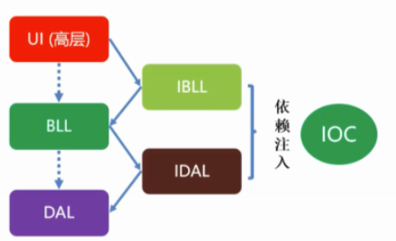

### DI简介

在创建对象的实例时，如果对象A，依赖于对象B,对象B依赖于对象C，那么在创建对象A的时候，
自动的把对象C创建出来交给对象B，再把对象B创建出来交给对象A，从而创建出对象A。
可以在全局跟一个ioc容器，配置抽象和具体普通之间的关系的时候，可以修改，这里修改了，获取实例就获取新的实例。


### 依赖注入的过程解释

1. **IoC 容器的作用**

IoC 容器的核心职责是管理对象的创建、配置及它们的依赖关系。在传统的编程模式下，类需要手动创建它所依赖的对象，而在使用 IoC 容器时，容器会根据配置自动创建并注入这些依赖对象。这一过程称为“依赖注入”。

2. **服务注册**

在 `Program.cs` 中，我们通过以下代码将 `IMyService` 和它的实现 `MyService` 注册到 IoC 容器中：

```c#
builder.Services.AddSingleton<IMyService, MyService>();
```

这句话做了两件事：

- **注册服务接口 `IMyService`**：告诉容器，当需要 `IMyService` 的实例时，它应该提供什么。
- **指定服务的实现 `MyService`**：告诉容器，当请求 `IMyService` 时，实际上应该返回 `MyService` 的实例。

3. **构造函数注入的工作原理**

当 `HomeController` 被创建时，.NET 的依赖注入框架会查看 `HomeController` 的构造函数，找到它的参数。它会看到 `HomeController` 的构造函数需要一个 `IMyService` 类型的参数：

```csharp
public HomeController(IMyService myService)
{
    _myService = myService;
}
```

此时，框架会做以下几步：

1. **查找服务注册**：框架会查看 IoC 容器中的服务注册信息，找到 `IMyService` 的实现类。在我们的注册中，`IMyService` 对应的是 `MyService`。
2. **创建服务实例**：框架会创建一个 `MyService` 的实例，或者在 `AddSingleton` 的情况下，直接使用已经创建好的单例实例。
3. **注入服务实例**：框架将 `MyService` 的实例作为参数传递给 `HomeController` 的构造函数。

4. **为什么框架会自动注入？**

框架自动注入的原因是依赖注入容器（IoC 容器）自动处理对象的生命周期和依赖关系。具体来说：

- **依赖关系的注册**：通过 `AddSingleton<IMyService, MyService>()`，你明确告诉 IoC 容器，“每当你需要 `IMyService` 时，使用 `MyService` 来满足这个需求”。
- **对象的解析**：当框架需要实例化 `HomeController` 时，它会自动解析 `HomeController` 所依赖的对象（即 `IMyService`），并从 IoC 容器中获取对应的实现（即 `MyService`）。
- **对象的创建与注入**：IoC 容器根据依赖关系的注册情况自动创建 `MyService` 的实例，并将它注入到 `HomeController` 的构造函数中。

5. **总结**

当 `HomeController` 被请求时，框架会根据控制器的构造函数签名查找所需的依赖，并从 IoC 容器中获取这些依赖的实例（如 `MyService`）。由于 `IMyService` 已经在容器中注册为 `MyService` 的实现，框架会自动生成 `MyService` 的实例并注入到 `HomeController` 中。这一切的关键在于依赖关系的注册和 IoC 容器的解析能力。

### 生命周期

依赖注入有三种方式，请区分

**AddSingleton→AddTransient→AddScoped**

**AddSingleton的生命周期：**
项目启动-项目关闭  相当于静态类  只会有一个  

**AddScoped的生命周期：**
请求开始-请求结束  在这次请求中获取的对象都是同一个 

**AddTransient的生命周期：**
请求获取-（GC回收-主动释放） 每一次获取的对象都不是同一个

## WebAPI

### 创建

创建一个ASP.NET Core WebAPI 项目 直接运行
即可跳转到Swagger界面（已内置）
已存在示例控制器 Weatherforcast

### swaggerui

#### 封装注册代码

如果想自定义swagger可以做一个封装再放到配置里

~~~c#
/// <summary>
    /// swagger启动服务
    /// </summary>
    public static class SwaggerSetUp
    {
        public static void AddSwaggerSetup(this IServiceCollection services)
        {
            if (services == null)
                throw new ArgumentNullException(nameof(services));
 
            var ApiName = "Web.Core";
 
            services.AddSwaggerGen(c =>
            {
                c.SwaggerDoc("V1", new OpenApiInfo
                {
                    // {ApiName} 定义成全局变量，方便修改
                    Version = "V1",
                    Title = $"{ApiName} 接口文档——.NetCore 6.0",
                    Description = $"{ApiName} HTTP API V1",
                });
                c.OrderActionsBy(o => o.RelativePath);
                
            });
 
        }
    }
~~~

~~~c#
//注册swagger
builder.Services.AddSwaggerSetup();
~~~

~~~c#
if (app.Environment.IsDevelopment())
{
    app.UseDeveloperExceptionPage();
}
 
app.UseSwagger();
app.UseSwaggerUI(c =>
{
    c.SwaggerEndpoint($"/swagger/V1/swagger.json", $"Web.Core.API V1");
 
    //路径配置，设置为空，表示直接在根域名（localhost:8001）访问该文件,注意localhost:8001/swagger是访问不到的，去launchSettings.json把launchUrl去掉，如果你想换一个路径，直接写名字即可，比如直接写c.RoutePrefix = "doc";
    c.RoutePrefix = "ocs";
});
~~~

#### 显示接口注释

属性-勾选此项

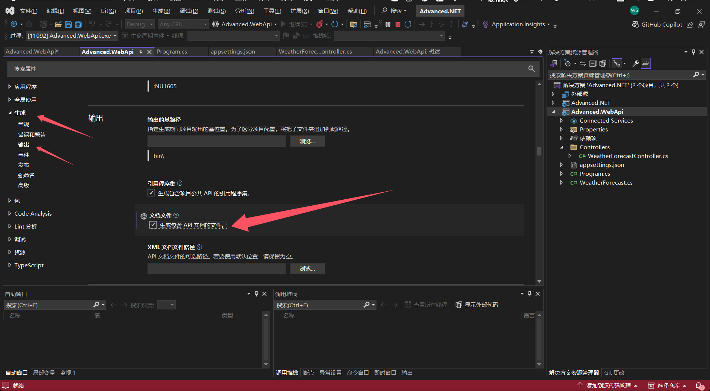

然后重新运行，会生成

在SwaggerSetup添加代码

~~~c#
services.AddSwaggerGen(c =>
            {
                c.SwaggerDoc("V1", new OpenApiInfo
                {
                    // {ApiName} 定义成全局变量，方便修改
                    Version = "V1",
                    Title = $"{ApiName} 接口文档——.NetCore 6.0",
                    Description = $"{ApiName} HTTP API V1",
                });
                c.OrderActionsBy(o => o.RelativePath);
 
                var xmlPath = Path.Combine(AppContext.BaseDirectory, "Web.Core.API.xml");//这个就是刚刚配置的xml文件名
                c.IncludeXmlComments(xmlPath, true);//默认的第二个参数是false，这个是controller的注释，记得修改
            });
~~~

这时添加的注释就可以显示了，设置完swagger页面路径(这里是docs)  可以再去lauchSettings.json里把运行后默认跳转页面改一下

额外：没写注释的全都有warning

解决：在属性的错误和警告中取消1951（需要重启vs生效）

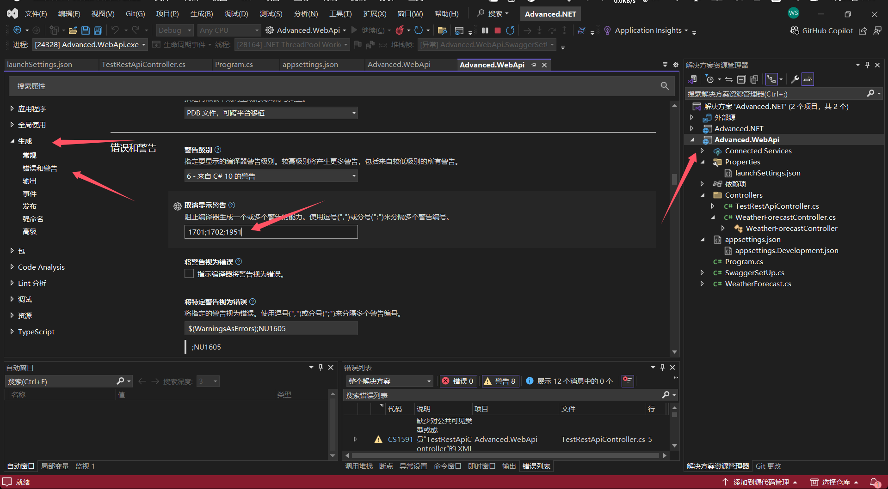

### post传参的三种方式

B.后端接收参数方式

\1. 实体类

实体类是比较简单的一种传参方式，使用频率非常高。

1. 实体类传参

**必须public，否则不能写入**

```csharp
public class Student
{
    public string Name { get; set; }
    public int Age { get; set; }
}
```

**后台处理Post请求代码**

```csharp
[HttpPost("{id}")]
public void PostStudent(Student student)
{
}
```

2.dynamic动态类型

后台处理Post请求代码

```csharp
[HttpPost("{id}")]
public void PostStudent(dynamic student)
{
    var name = student.name;//name大小写与前端参数一致
    var age = student.age;
}
```

3.JObject参数

1. 引入Microsoft.AspNetCore.Mvc.NewtonsoftJson包
2. 添加引用 `using Newtonsoft.Json.Linq;`
3. 后台处理Post请求代码

```csharp
[HttpPost("{id}")]
public void PostStudent(JObject student)
{
}
```

4.单值参数(字符串参数)

只能传一个字符串参数

1. 后台处理Post请求代码

```csharp
[HttpPost("{id}")]
public void PostStudent([FromBody] string values)
{
}
```

WebApi 方法参数前加[FromBody]标识，表示该参数值应该从请求的Body中获取，而不是从URL中获取。不加[FromBody]标识后台取不到参数值。

### JWT

#### 原理：

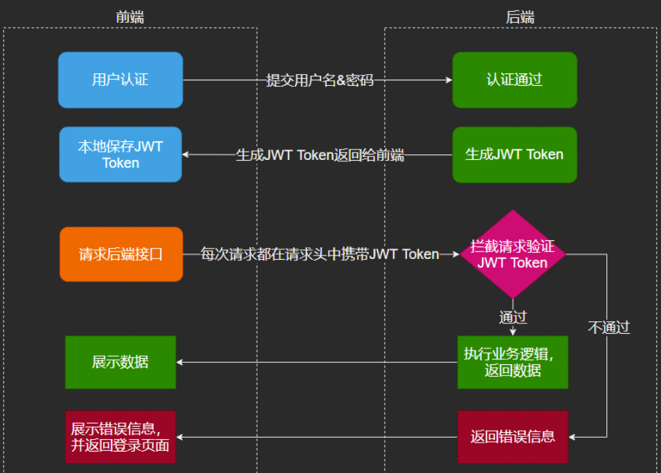

#### 构建步骤

##### Nuget

    //Nuget引入：Microsoft.IdentityModel.Tokens
    
    //Nuget引入：System.IdentityModel.Tokens.Jwt

##### 搭建jwt认证服务器

###### AppSettings中药添加秘钥与其他信息

~~~c#
{
  "Logging": {
    "LogLevel": {
      "Default": "Information",
      "Microsoft.AspNetCore": "Warning"
    }
  },
  "AllowedHosts": "*",
  "JWTTokenOptions": {
    "Audience": "http://localhost:5200",//接受者
    "Issuer": "http://localhost:5200",//发行者
    "SecurityKey": "MIGfMA0GCSqGSIb3DQEBAQUAA4GNADCBiQKBgQDI2a2EJ7m872v0afyoSDJT2o1+SitIeJSWtLJU8/Wz2m7gStexajkeD+Lka6DSTy8gt9UwfgVQo6uKjVLG5Ex7PiGOODVqAEghBuS7JzIYU5RvI543nNDAPfnJsas96mSA7L/mD7RTE2drj6hf3oZjJpMPZUQI/B1Qjb5H3K3PNwIDAQAB"
  }
}

~~~


###### JWT认证类

~~~c#
using System;
using System.Collections.Generic;
using System.Linq;
using System.Threading.Tasks;

namespace Advanced.NET6.Jwt.AuthenticationCenter.Utility
{
    public class JWTTokenOptions
    {
        public string Audience
        {
            get;
            set;
        }
        public string SecurityKey
        {
            get;
            set;
        }
        //public SigningCredentials Credentials
        //{
        //    get;
        //    set;
        //}
        public string Issuer
        {
            get;
            set;
        }
    }
}

~~~


###### 服务接口

~~~c#
using System;
using System.Collections.Generic;
using System.Linq;
using System.Threading.Tasks;

namespace Advanced.NET6.Jwt.AuthenticationCenter.Utility
{
    public interface ICustomJWTService
    {
        string GetToken(string UserName, string password);
    }
}

~~~


###### JWT服务

~~~c#
using Microsoft.Extensions.Options;
using Microsoft.IdentityModel.Tokens;
using System;
using System.Collections.Generic;
using System.IdentityModel.Tokens.Jwt;
using System.Linq;
using System.Security.Claims;
using System.Text;
using System.Threading.Tasks;

namespace Advanced.NET6.Jwt.AuthenticationCenter.Utility
{
    public class CustomHSJWTService : ICustomJWTService
    {
        #region Option注入
        private readonly JWTTokenOptions _JWTTokenOptions;
        public CustomHSJWTService(IOptionsMonitor<JWTTokenOptions> jwtTokenOptions)
        {
            this._JWTTokenOptions = jwtTokenOptions.CurrentValue;
        }
        #endregion
        /// <summary>
        /// 用户登录成功以后，用来生成Token的方法
        /// </summary>
        /// <param name="UserName"></param>
        /// <returns></returns>
        public string GetToken(string UserName, string password)
        {
            #region 有效载荷，大家可以自己写，爱写多少写多少；尽量避免敏感信息
            var claims = new[]
            {
               new Claim(ClaimTypes.Name, UserName),
                new Claim(ClaimTypes.Role, "teache0"),
               new Claim("NickName",UserName),
               new Claim("Role","Administrator"),//传递其他信息   
               new Claim("ABCC","ABCC"),
               new Claim("Student","甜酱油")
            };

            //需要加密：需要加密key:
            //Nuget引入：Microsoft.IdentityModel.Tokens
            SymmetricSecurityKey key = new SymmetricSecurityKey(Encoding.UTF8.GetBytes(_JWTTokenOptions.SecurityKey));

            SigningCredentials creds = new SigningCredentials(key, SecurityAlgorithms.HmacSha256);

            //Nuget引入：System.IdentityModel.Tokens.Jwt
            JwtSecurityToken token = new JwtSecurityToken(
             issuer: _JWTTokenOptions.Issuer,
             audience: _JWTTokenOptions.Audience,
             claims: claims,
             expires: DateTime.Now.AddMinutes(5),//5分钟有效期
             signingCredentials: creds);

            string returnToken = new JwtSecurityTokenHandler().WriteToken(token);
            return returnToken;
            #endregion

        }
    }
}

~~~


###### 控制器

~~~c#

    [Route("api/[controller]")]
    [ApiController]
    public class AuthenticationController : ControllerBase
    {
        private ICustomJWTService _iJWTService = null;
        public AuthenticationController(ICustomJWTService customJWTService)
        {
            _iJWTService = customJWTService;
        }
         
        [Route("Get")]
        [HttpGet]
        public IEnumerable<int> Get()
        {
            return new List<int>() { 1, 2, 3, 4, 6, 7 };
        }

        [Route("Login")]
        [HttpPost]
        public string Login(string name, string password)
        {
            //在这里需要去数据库中做数据验证
            if ("Richard".Equals(name) && "123456".Equals(password))
            {
                //就应该生成Token 
                string token = this._iJWTService.GetToken(name, password);
                return JsonConvert.SerializeObject(new
                {
                    result = true,
                    token
                });

            }
            else
            {
                return JsonConvert.SerializeObject(new
                {
                    result = false,
                    token = ""
                });
            }
        }
    }

~~~

###### 注册

~~~c#

var builder = WebApplication.CreateBuilder(args);

// Add services to the container.

builder.Services.AddControllers();
// Learn more about configuring Swagger/OpenAPI at https://aka.ms/aspnetcore/swashbuckle

builder.Services.Configure<JWTTokenOptions>(builder.Configuration.GetSection("JWTTokenOptions"));
builder.Services.AddTransient<ICustomJWTService, CustomHSJWTService>();
 
builder.Services.AddEndpointsApiExplorer();
builder.Services.AddSwaggerGen();

var app = builder.Build();

// Configure the HTTP request pipeline.
if (app.Environment.IsDevelopment())
{
    app.UseSwagger();
    app.UseSwaggerUI();
}

app.UseHttpsRedirection();

app.UseAuthorization();

app.MapControllers();

app.Run();

~~~


##### 鉴权授权拦截

###### Appsettings添加信息

~~~xml
{
  "Logging": {
    "LogLevel": {
      "Default": "Information",
      "Microsoft.AspNetCore": "Warning"
    }
  },
  "AllowedHosts": "*",
  "JWTTokenOptions": {
    "Audience": "http://localhost:5200",
    "Issuer": "http://localhost:5200",
    "SecurityKey": "MIGfMA0GCSqGSIb3DQEBAQUAA4GNADCBiQKBgQDI2a2EJ7m872v0afyoSDJT2o1+SitIeJSWtLJU8/Wz2m7gStexajkeD+Lka6DSTy8gt9UwfgVQo6uKjVLG5Ex7PiGOODVqAEghBuS7JzIYU5RvI543nNDAPfnJsas96mSA7L/mD7RTE2drj6hf3oZjJpMPZUQI/B1Qjb5H3K3PNwIDAQAB"
  }
}

~~~


###### JWT认证类

~~~c#

    public class JWTTokenOptions
    {
        public string Audience
        {
            get;
            set;
        }
        public string SecurityKey
        {
            get;
            set;
        }
        //public SigningCredentials Credentials
        //{
        //    get;
        //    set;
        //}
        public string Issuer
        {
            get;
            set;
        }
    }

~~~

###### 注册

~~~c#
    #region jwt校验  HS
    {
        //第二步，增加鉴权逻辑
        JWTTokenOptions tokenOptions = new JWTTokenOptions();
        builder.Configuration.Bind("JWTTokenOptions", tokenOptions);
        builder.Services.AddAuthentication(JwtBearerDefaults.AuthenticationScheme)//Scheme
         .AddJwtBearer(options =>  //这里是配置的鉴权的逻辑
         {
             options.TokenValidationParameters = new TokenValidationParameters
             {
                 //JWT有一些默认的属性，就是给鉴权时就可以筛选了
                 ValidateIssuer = true,//是否验证Issuer
                 ValidateAudience = true,//是否验证Audience
                 ValidateLifetime = true,//是否验证失效时间
                 ValidateIssuerSigningKey = true,//是否验证SecurityKey
                 ValidAudience = tokenOptions.Audience,//
                 ValidIssuer = tokenOptions.Issuer,//Issuer，这两项和前面签发jwt的设置一致
                 IssuerSigningKey = new SymmetricSecurityKey(Encoding.UTF8.GetBytes(tokenOptions.SecurityKey))//拿到SecurityKey 
             };
         });
    }
    #endregion
~~~


~~~c#
#region 鉴权授权
app.UseAuthentication();
app.UseAuthorization();
#endregion
~~~

###### 测试

~~~c#
/// <summary>
/// 获取数据
/// </summary>
/// <returns></returns>
[HttpGet]
//[Route("GetData")] 
[Authorize(AuthenticationSchemes= JwtBearerDefaults.AuthenticationScheme)]
public object GetData()
{
    Console.WriteLine("请求到了~~");
    return new
    {
        Id = 123,
        Name = "Richard"
    };
}
~~~

### 跨域

https://blog.csdn.net/yangshuquan/article/details/135295093

## EF Core

EFCore版本与.NET版本相对应

DBFirst与CodeFirst

顾名思义，就是在构建orm层时，先构建数据表再生成实体类，还是先构建实体类再生成数据表。

### **DBFirst**

**1.Nuget包**

Microsoft.EntityFrameworkCore
Microsoft.EntityFrameworkCore.SqlServer
Microsoft.EntityFrameworkCore.SqlServer.Design
Microsoft.EntityFrameworkCore.Tools

**2.打开程序管理器控制台->默认项目（选择解决方案）**

记得把中括号去了

~~~shell
Scaffold-DbContext "Data Source =[数据库地址，本机用.];Initial Catalog =[数据库名称];Persist Security Info=True;User ID=[数据库用户名];Password=[数据库密码];Encrypt=False;" Microsoft.EntityFrameworkCore.SqlServer -OutputDir Models -ContextDir Models -Context CustomerDbContext -Force
~~~

~~~xml
Scaffold-DbContext "Data Source =BDsnake;Initial Catalog =AdvancedCustomerDB;Persist Security Info=True;User ID=sa;Password=qsj123;Encrypt=False;" Microsoft.EntityFrameworkCore.SqlServer -OutputDir Models -ContextDir Models -Context CustomerDbContext -Force
~~~

3.配置数据库链接字符串

自动生成的为硬编码连接信息，这一步是将其修改为配置文件注入型

生成CustomerDbContext.cs修改

~~~c#
    protected override void OnConfiguring(DbContextOptionsBuilder optionsBuilder)
    {
        base.OnConfiguring(optionsBuilder);
    }
~~~

配置文件appsettings.json

~~~xml
  "ConnectionStrings": {
    "DefaultConnection": "Data Source =[数据库地址，本机用.];Initial Catalog =[数据库名称];Persist Security Info=True;User ID=[数据库用户名];Password=[数据库密码];Encrypt=False;"
}
~~~

把CustomerDbContext对象注入IOC容器进行管理Program.cs

~~~c#
//dbcontext
builder.Services.AddDbContext<CustomerDbContext>(option =>
{
    option.UseSqlServer("name=ConnectionStrings:DefaultConnection");
});
~~~

### CodeFirst

**1.Nuget包**

1. Microsoft.EntityFrameworkCore.SqlServer
2. Microsoft.EntityFrameworkCore.Tools

**2.添加数据库表类文件和操作文件**

~~~c#
    public class User
    {
        public int ID { get; set; }
        public string Account { get; set; }
        public string Password { get; set; }
 
    }
~~~

~~~c#
    public class CustomerDbContext:DbContext
    {
        public virtual DbSet<User> Users { get; set; }
        public virtual DbSet<Production> Productions { get; set; }
        public CustomerDbContext(DbContextOptions options):base(options) 
        {
        }
    }
~~~

**3.配置数据库连连接字符串**

配置文件appsettings.json

~~~json
  "ConnectionStrings": {
    "DefaultConnection": "Data Source =[数据库地址，本机用.];Initial Catalog =[数据库名称];Persist Security Info=True;User ID=[数据库用户名];Password=[数据库密码];Encrypt=False;"
~~~

把DbContext对象放到IOC容器进行管理Program.cs

~~~c#
builder.Services.AddDbContext<CustomerDbContext>(option =>
{
    option.UseSqlServer("name=ConnectionStrings:DefaultConnection");
});
~~~

**4.打开程序管理器控制台->默认项目（选择解决方案）**

初始化：add-migration init

更新：update-database

注：修改表也是当前命令

### EF迁移

“迁移”（Migration）可以理解为将**实体类**的变化转换为对数据库修改的方案，应用迁移就是将这个修改方案应用到数据库。其次，迁移也记录了数据库的版本历史等信息。

这里直接举例讲解EF迁移

#### 初始化

**1. 创建项目**

略

**2. nuget导包**

~~~cmd
dotnet add package Microsoft.EntityFrameworkCore
dotnet add package Microsoft.EntityFrameworkCore.Sqlite
dotnet add package Microsoft.EntityFrameworkCore.Tools
//或者下面这个，好像Tools过时了
Microsoft.EntityFrameworkCore.Design
~~~

**3. 创建实体类**

在 `Models` 文件夹中创建一个新的类，例如 `Product.cs`：

~~~c#
using System;

namespace MyProductApi.Models
{
    public class Product
    {
        public Guid ID { get; set; }
        public string Name { get; set; }
        public DateTime ReleaseDate { get; set; }
        public decimal Price { get; set; }
    }
}

~~~

**4. 创建DbContext**

在 `Data` 文件夹中创建一个名为 `AppDbContext.cs` 的文件：

~~~c#
using Microsoft.EntityFrameworkCore;
using MyProductApi.Models;

namespace MyProductApi.Data
{
    public class AppDbContext : DbContext
    {
        public AppDbContext(DbContextOptions<AppDbContext> options) : base(options) { }

        public DbSet<Product> Products { get; set; }
    }
}

~~~

**5.配置服务**

在 `Program.cs` 中配置 EF Core 和 SQLite：

~~~c#
using Microsoft.EntityFrameworkCore;
using MyProductApi.Data;

var builder = WebApplication.CreateBuilder(args);

// Add services to the container.
builder.Services.AddDbContext<AppDbContext>(options =>
    options.UseSqlite("Data Source=products.db"));

builder.Services.AddControllers();

var app = builder.Build();

// Configure the HTTP request pipeline.
app.UseAuthorization();
app.MapControllers();

app.Run();

~~~

**6.创建迁移**

运行以下命令创建初始迁移：

~~~shell
dotnet ef migrations add InitialCreate
~~~

**7.更新数据库**

运行以下命令应用迁移到 SQLite 数据库：

~~~c#
dotnet ef database update
~~~

**8.控制器**

这时可测试基本新增与查询功能是否正常

~~~c#
using Microsoft.AspNetCore.Mvc;
using Microsoft.EntityFrameworkCore;
using MyProductApi.Data;
using MyProductApi.Models;

namespace MyProductApi.Controllers
{
    [Route("api/[controller]")]
    [ApiController]
    public class ProductsController : ControllerBase
    {
        private readonly AppDbContext _context;

        public ProductsController(AppDbContext context)
        {
            _context = context;
        }

        [HttpGet]
        public async Task<ActionResult<IEnumerable<Product>>> GetProducts()
        {
            return await _context.Products.ToListAsync();
        }

        [HttpPost]
        public async Task<ActionResult<Product>> PostProduct(Product product)
        {
            product.ID = Guid.NewGuid(); // 自动生成 ID
            _context.Products.Add(product);
            await _context.SaveChangesAsync();
            return CreatedAtAction(nameof(GetProducts), new { id = product.ID }, product);
        }
    }
}

~~~

**9.创建新迁移**

如果后续需要添加新字段或修改模型，可以按以下步骤操作：

1. 修改模型：在 `Product.cs` 中添加新的属性。

这里改了一个字段

~~~c#
namespace EF迁移测试.Models
{
    public class Product
    {
        public Guid ID { get; set; }
        public string Name { get; set; }
        public DateTime ReleaseDate { get; set; }
        public int Number { get; set; }
    }
}

~~~

2.创建新的迁移：

~~~c#
dotnet ef migrations add AddNewField
~~~

3.更新数据库

~~~shell
dotnet ef database update
~~~

**10.迁移回滚**

首先，你可以查看当前的迁移历史，以确定你想回滚到哪个迁移。运行以下命令：

~~~shell
dotnet ef migrations list
~~~

回滚到指定迁移

~~~shell
dotnet ef database update InitialCreate
~~~

回滚到最初状态

~~~shell
dotnet ef database update 0
~~~

**11.删除迁移**

删除最后一个迁移

~~~shell
dotnet ef migrations remove
~~~

## 拓展：使用yaml配置

因为我觉得（只是我觉得）yaml的配置更好看也便于修改，所以找了下如何用yaml做配置，未必是推荐使用的（我不清楚）

先安装 NuGet 包 `Microsoft.Extensions.Configuration.Yaml`，然后加载 YML 配置文件。

### 1. 创建 `appsettings.yml`

内容示例如下：

```yaml
SqlSugar:
  ConnectionString: "your_connection_string_here"
  DbType: "SqlServer"
  IsAutoCloseConnection: true
  InitKeyType: "Attribute"
```

### 2. 加载 YML 配置

在 `Program.cs` 中加载 YML 配置文件：

```c#
var builder = WebApplication.CreateBuilder(args);
builder.Configuration.AddYamlFile("appsettings.yml", optional: false, reloadOnChange: true);
builder.Services.Configure<SqlSugarSettings>(builder.Configuration.GetSection("SqlSugar"));
```

## 常用方法

### 判断是否Ajax请求

~~~c#
private bool IsAjaxRequest(HttpRequest request)
{
    //HttpWebRequest httpWebRequest = null;
    //httpWebRequest.Headers.Add("X-Requested-With", "XMLHttpRequest"); 
    string header = request.Headers["X-Requested-With"];
    return "XMLHttpRequest".Equals(header);
}
~~~

### crud方法包装

公共业务逻辑

~~~c#
using Microsoft.Data.SqlClient;
using System;
using System.Collections.Generic;
using System.Linq;
using System.Linq.Expressions;
using System.Text;
using System.Threading.Tasks;

namespace Advanced.NET6.Business.Interfaces
{
    public interface IBaseService
    {
        #region Query
        /// <summary>
        /// 根据id查询实体
        /// </summary>
        /// <param name="id"></param>
        /// <returns></returns>
        T Find<T>(int id) where T : class;

        /// <summary>
        /// 提供对单表的查询
        /// </summary>
        /// <returns>IQueryable类型集合</returns>
        [Obsolete("尽量避免使用，using 带表达式目录树的 代替")]
        IQueryable<T> Set<T>() where T : class;

        /// <summary>
        /// 查询
        /// </summary>
        /// <typeparam name="T"></typeparam>
        /// <param name="funcWhere"></param>
        /// <returns></returns>
        IQueryable<T> Query<T>(Expression<Func<T, bool>> funcWhere) where T : class;

        /// <summary>
        /// 分页查询
        /// </summary>
        /// <typeparam name="T"></typeparam>
        /// <typeparam name="S"></typeparam>
        /// <param name="funcWhere"></param>
        /// <param name="pageSize"></param>
        /// <param name="pageIndex"></param>
        /// <param name="funcOrderby"></param>
        /// <param name="isAsc"></param>
        /// <returns></returns>
        PageResult<T> QueryPage<T, S>(Expression<Func<T, bool>> funcWhere, int pageSize, int pageIndex, Expression<Func<T, S>> funcOrderby, bool isAsc = true) where T : class;
        #endregion

        #region Add
        /// <summary>
        /// 新增数据，即时Commit
        /// </summary>
        /// <param name="t"></param>
        /// <returns>返回带主键的实体</returns>
        T Insert<T>(T t) where T : class;

        /// <summary>
        /// 新增数据，即时Commit
        /// 多条sql 一个连接，事务插入
        /// </summary>
        /// <param name="tList"></param>
        IEnumerable<T> Insert<T>(IEnumerable<T> tList) where T : class;
        #endregion

        #region Update
        /// <summary>
        /// 更新数据，即时Commit
        /// </summary>
        /// <param name="t"></param>
        void Update<T>(T t) where T : class;

        /// <summary>
        /// 更新数据，即时Commit
        /// </summary>
        /// <param name="tList"></param>
        void Update<T>(IEnumerable<T> tList) where T : class;
        #endregion

        #region Delete
        /// <summary>
        /// 根据主键删除数据，即时Commit
        /// </summary>
        /// <param name="t"></param>
        void Delete<T>(int Id) where T : class;

        /// <su+mary>
        /// 删除数据，即时Commit
        /// </summary>
        /// <param name="t"></param>
        void Delete<T>(T t) where T : class;

        /// <summary>
        /// 删除数据，即时Commit
        /// </summary>
        /// <param name="tList"></param>
        void Delete<T>(IEnumerable<T> tList) where T : class;
        #endregion

        #region Other
        /// <summary>
        /// 立即保存全部修改
        /// 把增/删的savechange给放到这里，是为了保证事务的
        /// </summary>
        void Commit();

        /// <summary>
        /// 执行sql 返回集合
        /// </summary>
        /// <param name="sql"></param>
        /// <param name="parameters"></param>
        /// <returns></returns>
        IQueryable<T> ExcuteQuery<T>(string sql, SqlParameter[] parameters) where T : class;

        /// <summary>
        /// 执行sql，无返回
        /// </summary>
        /// <param name="sql"></param>
        /// <param name="parameters"></param>
        void Excute<T>(string sql, SqlParameter[] parameters) where T : class;

        #endregion


        #region 伪代码
        //public void Add();

        //public void Update();

        //public void Delete();

        //public void Query();
        #endregion
    }
}

~~~


~~~c#
using Advanced.NET6.Business.Interfaces;
using Advanced.NET6.Framework;
using Microsoft.Data.SqlClient;
using Microsoft.EntityFrameworkCore;
using Microsoft.EntityFrameworkCore.Storage;
using System;
using System.Collections.Generic;
using System.Linq;
using System.Linq.Expressions;
using System.Text;
using System.Threading.Tasks;

namespace Advanced.NET6.Business.Services
{
    public abstract class BaseService : IBaseService
    {
        protected DbContext Context { get; set; }

        /// <summary>
        /// 
        /// </summary>
        /// <param name="context"></param> 
        public BaseService(DbContext context)
        {
            Console.WriteLine($"{this.GetType().FullName}被构造....");
            Context = context;
        }

        #region Query
        public T Find<T>(int id) where T : class
        {
            return this.Context.Set<T>().Find(id);
        }

        /// <summary>
        /// 不应该暴露给上端使用者，尽量少用
        /// </summary>
        /// <typeparam name="T"></typeparam>
        /// <returns></returns>
        //[Obsolete("尽量避免使用，using 带表达式目录树的代替")]
        public IQueryable<T> Set<T>() where T : class
        {
            return this.Context.Set<T>();
        }

        /// <summary>
        /// 这才是合理的做法，上端给条件，这里查询
        /// </summary>
        /// <typeparam name="T"></typeparam>
        /// <param name="funcWhere"></param>
        /// <returns></returns>
        public IQueryable<T> Query<T>(Expression<Func<T, bool>> funcWhere) where T : class
        {
            return this.Context.Set<T>().Where<T>(funcWhere);
        }

        public PageResult<T> QueryPage<T, S>(Expression<Func<T, bool>> funcWhere, int pageSize, int pageIndex, Expression<Func<T, S>> funcOrderby, bool isAsc = true) where T : class
        {
            var list = Set<T>();
            if (funcWhere != null)
            {
                list = list.Where<T>(funcWhere);
            }
            if (isAsc)
            {
                list = list.OrderBy(funcOrderby);
            }
            else
            {
                list = list.OrderByDescending(funcOrderby);
            }
            PageResult<T> result = new PageResult<T>()
            {
                DataList = list.Skip((pageIndex - 1) * pageSize).Take(pageSize).ToList(),
                PageIndex = pageIndex,
                PageSize = pageSize,
                TotalCount = list.Count()
            };
            return result;
        }
        #endregion

        #region Insert
        /// <summary>
        /// 即使保存  不需要再Commit
        /// </summary>
        /// <typeparam name="T"></typeparam>
        /// <param name="t"></param>
        /// <returns></returns>
        public T Insert<T>(T t) where T : class
        {
            this.Context.Set<T>().Add(t);
            this.Commit();//写在这里  就不需要单独commit  不写就需要
            return t;
        }

        public IEnumerable<T> Insert<T>(IEnumerable<T> tList) where T : class
        {
            this.Context.Set<T>().AddRange(tList);
            this.Commit();//一个链接  多个sql
            return tList;
        }
        #endregion

        #region Update
        /// <summary>
        /// 是没有实现查询，直接更新的,需要Attach和State
        /// 
        /// 如果是已经在context，只能再封装一个(在具体的service)
        /// </summary>
        /// <typeparam name="T"></typeparam>
        /// <param name="t"></param>
        public void Update<T>(T t) where T : class
        {
            if (t == null) throw new Exception("t is null");

            this.Context.Set<T>().Attach(t);//将数据附加到上下文，支持实体修改和新实体，重置为UnChanged
            this.Context.Entry<T>(t).State = EntityState.Modified;
            this.Commit();//保存 然后重置为UnChanged
        }

        public void Update<T>(IEnumerable<T> tList) where T : class
        {
            foreach (var t in tList)
            {
                this.Context.Set<T>().Attach(t);
                this.Context.Entry<T>(t).State = EntityState.Modified;
            }
            this.Commit();
        }

        #endregion

        #region Delete
        /// <summary>
        /// 先附加 再删除
        /// </summary>
        /// <typeparam name="T"></typeparam>
        /// <param name="t"></param>
        public void Delete<T>(T t) where T : class
        {
            if (t == null) throw new Exception("t is null");
            this.Context.Set<T>().Attach(t);
            this.Context.Set<T>().Remove(t);
            this.Commit();
        }

        /// <summary>
        /// 还可以增加非即时commit版本的，
        /// 做成protected
        /// </summary>
        /// <typeparam name="T"></typeparam>
        /// <param name="Id"></param>
        public void Delete<T>(int Id) where T : class
        {
            T t = this.Find<T>(Id);//也可以附加
            if (t == null) throw new Exception("t is null");
            this.Context.Set<T>().Remove(t);
            this.Commit();
        }

        public void Delete<T>(IEnumerable<T> tList) where T : class
        {
            foreach (var t in tList)
            {
                this.Context.Set<T>().Attach(t);
            }
            this.Context.Set<T>().RemoveRange(tList);
            this.Commit();
        }
        #endregion

        #region Other
        public void Commit()
        {
            this.Context.SaveChanges();
        }

        public IQueryable<T> ExcuteQuery<T>(string sql, SqlParameter[] parameters) where T : class
        {
            return null;
        }

        public void Excute<T>(string sql, SqlParameter[] parameters) where T : class
        {
            IDbContextTransaction trans = null;
            //DbContextTransaction trans = null;
            try
            {
                trans = this.Context.Database.BeginTransaction();
                //this.Context.Database.ExecuteSqlRaw(sql, parameters);
                trans.Commit();
            }
            catch (Exception)
            {
                if (trans != null)
                    trans.Rollback();
                throw;
            }
        }

        public virtual void Dispose()
        {
            if (this.Context != null)
            {
                this.Context.Dispose();
            }
        } 
        #endregion


        #region 伪代码

        //private CustomerDbContext Context = new CustomerDbContext();

        //public void Add()
        //{
        //    //Context.Companies.Add;
        //    //Context.SaveChanges();
        //}

        //public void Delete()
        //{
        //    throw new NotImplementedException();
        //}

        //public void Qeury()
        //{
        //    throw new NotImplementedException();
        //}

        //public void Update()
        //{
        //    throw new NotImplementedException();
        //}
        #endregion
    }
}

~~~

### AutoMapper使用

#### 配置

~~~c#
var mapperConfig = new MapperConfiguration(cfg =>
{
    cfg.AddProfile(new MappingProfile());
});

// 创建 IMapper 实例
var mapper = mapperConfig.CreateMapper();
services.AddSingleton(mapper); // 注册 IMapper
~~~


AutoMapper 提供了多种方法来配置和使用对象映射，以下是一些常用的映射方法及其用法介绍。

1. 基本映射

基本映射是 AutoMapper 的核心功能，通过 `CreateMap` 方法创建源对象和目标对象之间的映射。

```
CreateMap<Source, Destination>();
```

2. 自定义成员映射

在映射过程中，可以使用 `ForMember` 方法自定义目标成员的映射。你可以使用 `MapFrom` 指定源对象中的哪个字段映射到目标对象的哪个字段。

```
CreateMap<Source, Destination>()
    .ForMember(dest => dest.FullName, opt => opt.MapFrom(src => src.FirstName + " " + src.LastName));
```

3. 忽略成员映射

如果你希望在映射过程中忽略某个成员，可以使用 `Ignore` 方法。

```
CreateMap<Source, Destination>()
    .ForMember(dest => dest.Id, opt => opt.Ignore());
```

4. 条件映射

你可以为某些字段设置条件，只有在特定条件下才进行映射。

```
CreateMap<Source, Destination>()
    .ForMember(dest => dest.Name, opt => opt.MapFrom(src => src.IsActive ? src.Name : null));
```

5. 批量映射

AutoMapper 支持批量映射，将一组源对象映射到一组目标对象。

```
var sourceList = new List<Source>();
var destinationList = _mapper.Map<List<Destination>>(sourceList);
```

6. 嵌套映射

如果源对象和目标对象中有嵌套的对象，AutoMapper 可以自动处理嵌套映射。

```
public class Address
{
    public string Street { get; set; }
    public string City { get; set; }
}

public class User
{
    public string Name { get; set; }
    public Address Address { get; set; }
}

public class UserDto
{
    public string Name { get; set; }
    public string FullAddress { get; set; }
}

CreateMap<User, UserDto>()
    .ForMember(dest => dest.FullAddress, opt => opt.MapFrom(src => $"{src.Address.Street}, {src.Address.City}"));
```

7. 自定义转换

你可以创建自定义的转换函数，以实现更复杂的映射逻辑。

```
CreateMap<Source, Destination>()
    .ConvertUsing(src => new Destination
    {
        FullName = $"{src.FirstName} {src.LastName}"
    });
```

8. 映射配置扩展

AutoMapper 允许你在多个配置文件中定义映射配置，并在启动时加载。

```
public class MappingProfile : Profile
{
    public MappingProfile()
    {
        CreateMap<Source, Destination>();
        // 其他映射...
    }
}

var config = new MapperConfiguration(cfg =>
{
    cfg.AddProfile<MappingProfile>();
});
```

9. 映射集合

AutoMapper 支持对集合进行映射，将源集合映射到目标集合。

```
var sourceList = new List<Source>();
var destinationList = _mapper.Map<List<Destination>>(sourceList);
```

10. 反向映射

AutoMapper 允许你设置双向映射，从目标对象反向映射到源对象。

```

CreateMap<Source, Destination>().ReverseMap();
```

11. 配置验证

在应用程序启动时，可以使用 `MapperConfiguration.AssertConfigurationIsValid()` 方法来验证所有的映射配置是否有效。

```
var config = new MapperConfiguration(cfg =>
{
    cfg.AddProfile<MappingProfile>();
});
config.AssertConfigurationIsValid(); // 验证配置
```

12. 映射上下文

你可以使用 `ResolutionContext` 来传递额外的信息和配置，在复杂的映射场景中非常有用。

```
CreateMap<Source, Destination>()
    .ConvertUsing((src, dest, context) => 
    {
        // 使用上下文进行映射
        return new Destination { Name = context.Options.Items["customName"].ToString() };
    });
```

总结

AutoMapper 提供了丰富的映射功能，可以处理多种复杂的对象映射场景。通过灵活配置映射规则和使用不同的映射方法，可以大大简化对象转换的代码，提高代码的可维护性和可读性。在实际应用中，你可以根据需求选择合适的映射策略。

# 进阶

## 解构方法 Deconstruct

### 概念

在 C# 中，**解构**（Deconstruction）是一种**将对象的属性值直接分解为单独变量的方式**，可以让代码更简洁和易读。解构通常通过在类或结构体中实现 `Deconstruct` 方法来实现。

简单理解：**解构是构造方法的反面。构造方法是给对象赋值，而解构方法是把对象的值赋给变量**

### 举例

创建Person类并定义**解构方法**

~~~csharp
public class Person
{
    public string FirstName { get; set; }
    public string LastName { get; set; }

    public Person(string firstName, string lastName)
    {
        FirstName = firstName;
        LastName = lastName;
    }

    // 定义 Deconstruct 方法
    public void Deconstruct(out string firstName, out string lastName)
    {
        firstName = FirstName;
        lastName = LastName;
    }
}

~~~

使用解构

~~~csharp
Person person = new Person("John", "Doe");

// 解构 person 对象
var (firstName, lastName) = person;

Console.WriteLine($"First Name: {firstName}, Last Name: {lastName}");

~~~

在这个例子中，通过解构语法 `(firstName, lastName) = person;`，可以直接将 `person` 的 `FirstName` 和 `LastName` 属性分别赋值给变量 `firstName` 和 `lastName`。

### 支持多态

~~~csharp
public void Deconstruct(out string firstName)
{
    firstName = FirstName;
}

public void Deconstruct(out string firstName, out string lastName)
{
    firstName = FirstName;
    lastName = LastName;
}

~~~

### 优势

**代码简洁**：无需逐个访问属性，减少冗余代码。

**语义清晰**：使用解构后，可以快速理解代码含义。

**多属性支持**：可以在 `Deconstruct` 方法中定义多个 `out` 参数来解构复杂对象的多层属性。

## 虚方法 virtual 

### 简介

在 C# 中，虚方法（`virtual method`）是指在基类中声明，并允许在派生类中被重写（`override`）的方法。虚方法的主要作用是为派生类提供定制行为的机制，帮助实现多态性。

- **定义**：虚方法在基类中用 `virtual` 关键字声明。派生类可以选择性地使用 `override` 关键字对其进行重写，也可以不重写。
- **多态性**：虚方法实现了运行时的多态性，在调用时会根据对象的实际类型而非编译时类型来决定执行哪个方法。
- **灵活性**：派生类可以改变基类的行为而无需更改基类代码，从而提高了代码的可扩展性和维护性。

### 行为

虚方法（`virtual` 方法）在 C# 中**不需要**必须被重写。`virtual` 关键字的作用主要是**提供一个可重写的标记**，让派生类可以根据需要选择性地重写它。换句话说，`virtual` 方法只是提供了一种**允许派生类重写**的机制，而不是强制要求派生类一定要重写它。

- 如果派生类没有重写虚方法，则调用基类的实现。
- 如果派生类选择重写虚方法，则会使用派生类的实现，调用该方法时会动态绑定到派生类的版本。

### 示例

~~~c#
public class Animal
{
    // 定义虚方法
    public virtual void MakeSound()
    {
        Console.WriteLine("Animal sound");
    }
}

public class Dog : Animal
{
    // 重写虚方法
    public override void MakeSound()
    {
        Console.WriteLine("Woof");
    }
}

public class Cat : Animal
{
    // 重写虚方法
    public override void MakeSound()
    {
        Console.WriteLine("Meow");
    }
}

Animal myDog = new Dog();
Animal myCat = new Cat();

myDog.MakeSound(); // 输出: Woof
myCat.MakeSound(); // 输出: Meow

~~~


## 局部类 partial

### 简介

在 C# 中，`partial` 关键字用于将类、结构体、接口或方法的定义拆分到多个文件中。这样可以让不同开发人员或工具在不互相影响的情况下扩展同一个类型，尤其在大型项目或自动生成代码的场景中非常有用。

### 特点与用途

- **分文件编写**：可以将一个类、结构体、接口的定义分散到多个文件中，编译时它们会组合成一个完整的类型。
- **维护和扩展便捷**：开发和维护变得更容易，特别是在项目中需要频繁更新代码或生成自动代码的情况下。
- **用于自动生成代码**：在设计器（如 Windows Forms Designer 或 Entity Framework）自动生成的代码与手动编写的代码分开时尤其有用

用途

> **UI 设计器**：例如 Windows Forms 的设计器会自动生成部分 UI 代码，而开发人员可以在其他部分文件中编写逻辑代码。
>
> **代码生成**：当代码生成工具自动生成部分代码时，开发者可以在另一文件中补充业务逻辑。
>
> **大型项目**：将代码逻辑分到不同文件中可以让代码结构更清晰，方便多人协作开发。

### 示例


~~~c#
public partial class Calculator
{
    public void Calculate()
    {
        BeforeCalculate(); // 调用部分方法
        Console.WriteLine("Calculating...");
    }

    // 声明部分方法
    partial void BeforeCalculate();
}

~~~


~~~c#
public partial class Calculator
{
    // 实现部分方法
    partial void BeforeCalculate()
    {
        Console.WriteLine("准备计算...");
    }
}

~~~

以上为两个不同的文件

## 抽象类 abstract

不介绍了，很基础

~~~c#
using System;

// 抽象类
public abstract class Animal
{
    // 抽象方法（必须重写）
    public abstract void Speak();

    // 具体方法（可选重写）
    public void Describe()
    {
        Console.WriteLine("这是一种动物");
    }
}

// 非抽象派生类
public class Dog : Animal
{
    // 必须重写抽象方法
    public override void Speak()
    {
        Console.WriteLine("汪汪");
    }

    // 可以选择重写具体方法
    public override void Describe()
    {
        Console.WriteLine("这是一只狗");
    }
}

// 另一个非抽象派生类
public class Cat : Animal
{
    // 必须重写抽象方法
    public override void Speak()
    {
        Console.WriteLine("喵喵");
    }
}

// 使用示例
public class Program
{
    public static void Main()
    {
        Animal dog = new Dog();
        dog.Speak();      // 输出：汪汪
        dog.Describe();   // 输出：这是一只狗

        Animal cat = new Cat();
        cat.Speak();      // 输出：喵喵
        cat.Describe();   // 输出：这是一种动物（Cat 没有重写具体方法）
    }
}

~~~

## 扩展方法

### 简介

在 C# 中，**扩展方法**（Extension Methods）是一种为现有类型添加新方法的技术，而无需修改该类型的代码或重新编译它们。扩展方法是静态方法，但在调用时表现得像是实例方法。它们通常用于增强类库或第三方库的功能，特别是在没有源代码的情况下。

### 扩展方法的特点

1. **静态方法**：扩展方法必须定义为静态方法，并且必须在静态类中。
2. **第一个参数**：扩展方法的第一个参数指定要扩展的类型，并且使用 `this` 关键字标记。例如，`this string str` 表示扩展 `string` 类型。
3. **可用于任何实例**：通过扩展方法，可以对任何符合扩展类型的实例调用新方法。

### 示例

~~~c#
using System;

// 定义一个静态类来包含扩展方法
public static class StringExtensions
{
    // 定义一个扩展方法，用于判断字符串是否为回文
    public static bool IsPalindrome(this string str)
    {
        if (string.IsNullOrEmpty(str))
            return false;

        var reversed = str.ToCharArray();
        Array.Reverse(reversed);
        return str.Equals(new string(reversed), StringComparison.OrdinalIgnoreCase);
    }
}

// 使用扩展方法
public class Program
{
    public static void Main()
    {
        string text = "A man a plan a canal Panama";
        
        // 使用扩展方法
        bool isPalindrome = text.IsPalindrome();
        
        Console.WriteLine($"'{text}' 是回文吗？ {isPalindrome}");  // 输出：'A man a plan a canal Panama' 是回文吗？ True
    }
}

~~~

1. **定义扩展方法**：
   - 在 `StringExtensions` 类中定义 `IsPalindrome` 扩展方法。
   - `this string str` 表示该方法扩展 `string` 类型。
2. **使用扩展方法**：
   - 在 `Main` 方法中，字符串 `text` 可以直接调用 `IsPalindrome()` 方法，就像是 `string` 类的一部分。

## 泛型

### 简介

在 C# 中，**泛型**（Generics）是一种强大的功能，允许你定义类、接口、和方法时使用占位符（类型参数），从而使它们能够处理各种数据类型。通过使用泛型，可以实现类型安全的代码复用，并且在编译时捕获类型错误。

### 特点

1. **类型安全**：泛型提供了在编译时检查类型的能力，减少了运行时错误的可能性。
2. **代码复用**：可以编写一次代码，处理多种数据类型，而不必为每种类型编写不同的实现。
3. **性能**：泛型避免了装箱和拆箱操作，尤其是在处理值类型时，从而提高性能。

### 泛型类

~~~csharp
// 定义一个泛型类
public class Box<T>
{
    private T item;

    public void Add(T newItem)
    {
        item = newItem;
    }

    public T Get()
    {
        return item;
    }
}

// 使用泛型类
public class Program
{
    public static void Main()
    {
        // 创建一个整数类型的 Box
        Box<int> intBox = new Box<int>();
        intBox.Add(123);
        Console.WriteLine(intBox.Get()); // 输出：123

        // 创建一个字符串类型的 Box
        Box<string> stringBox = new Box<string>();
        stringBox.Add("Hello, World!");
        Console.WriteLine(stringBox.Get()); // 输出：Hello, World!
    }
}

~~~

**解析**：

- `Box<T>` 是一个泛型类，`T` 是类型参数，可以是任何数据类型。
- `Add` 方法用于添加新项目，`Get` 方法用于获取项目。
- 在 `Main` 方法中，创建了 `Box<int>` 和 `Box<string>` 实例，可以分别处理 `int` 和 `string` 类型。

### 泛型方法

~~~csharp
public class Program
{
    // 定义一个泛型方法
    public static T GetFirst<T>(T[] items)
    {
        return items[0];
    }

    public static void Main()
    {
        // 使用泛型方法获取数组的第一个元素
        int[] numbers = { 1, 2, 3, 4, 5 };
        Console.WriteLine(GetFirst(numbers)); // 输出：1

        string[] words = { "Hello", "World" };
        Console.WriteLine(GetFirst(words)); // 输出：Hello
    }
}

~~~

**解析**：

- `GetFirst<T>(T[] items)` 是一个泛型方法，接收一个数组并返回第一个元素。
- 在 `Main` 方法中，调用 `GetFirst` 方法传入不同类型的数组。

### 泛型接口

~~~csharp
// 定义一个泛型接口
public interface IRepository<T>
{
    void Add(T item);
    T Get(int id);
}

// 实现泛型接口
public class InMemoryRepository<T> : IRepository<T>
{
    private List<T> items = new List<T>();

    public void Add(T item)
    {
        items.Add(item);
    }

    public T Get(int id)
    {
        return items[id]; // 简单实现，假设 id 是索引
    }
}

// 使用泛型接口
public class Program
{
    public static void Main()
    {
        IRepository<string> stringRepository = new InMemoryRepository<string>();
        stringRepository.Add("Item 1");
        Console.WriteLine(stringRepository.Get(0)); // 输出：Item 1
    }
}

~~~

**解析**：

- `IRepository<T>` 是一个泛型接口，定义了添加和获取项目的方法。
- `InMemoryRepository<T>` 实现了这个接口，并提供了具体的实现。
- 在 `Main` 方法中，创建了一个 `IRepository<string>` 实例并添加和获取字符串。

### 总结

- **泛型** 提供了在类、方法和接口中定义类型参数的能力，使得代码更加灵活和可重用。
- 通过使用泛型，可以创建类型安全的集合和数据结构，提高了代码的可读性和维护性。
- 泛型可以用于各种类型的应用场景，包括数据存储、算法和数据处理等


在 C# 中，**泛型协变（Covariance）**和**逆变（Contravariance）**是用于处理泛型类型参数之间转换的一种机制，主要用于接口和委托。这两种机制使得泛型类型的使用更加灵活。

### 1. 协变（Covariance）

**协变**允许你使用更具体的类型替代泛型参数，这通常适用于返回值的场景。它使得你可以将一个泛型类型的实例赋值给另一个泛型类型的实例，只要这两个类型之间有继承关系。

#### 示例

```csharp
public class Animal { }
public class Dog : Animal { }

// 定义一个泛型接口
public interface IProducer<out T>
{
    T Produce();
}

// 实现接口
public class DogProducer : IProducer<Dog>
{
    public Dog Produce()
    {
        return new Dog();
    }
}

// 使用协变
public class Program
{
    public static void Main()
    {
        IProducer<Dog> dogProducer = new DogProducer();
        IProducer<Animal> animalProducer = dogProducer; // 协变，允许从 IProducer<Dog> 到 IProducer<Animal>
        
        Animal animal = animalProducer.Produce(); // 返回 Dog 类型的对象
    }
}
```

**解释**：

- `IProducer<out T>` 表示该接口是协变的，使用 `out` 关键字声明 `T` 是协变参数。
- `dogProducer` 可以赋值给 `animalProducer`，因为 `Dog` 是 `Animal` 的子类。

### 2. 逆变（Contravariance）

**逆变**允许你使用更一般的类型替代泛型参数，这通常适用于方法参数的场景。逆变使得你可以将一个泛型类型的实例赋值给另一个泛型类型的实例，只要这两个类型之间有继承关系，且目标类型的参数必须是基类型。

#### 示例

```csharp
public class Animal { }
public class Dog : Animal { }

// 定义一个泛型接口
public interface IConsumer<in T>
{
    void Consume(T item);
}

// 实现接口
public class AnimalConsumer : IConsumer<Animal>
{
    public void Consume(Animal item)
    {
        // 处理 Animal
    }
}

// 使用逆变
public class Program
{
    public static void Main()
    {
        IConsumer<Animal> animalConsumer = new AnimalConsumer();
        IConsumer<Dog> dogConsumer = animalConsumer; // 逆变，允许从 IConsumer<Animal> 到 IConsumer<Dog>
        
        dogConsumer.Consume(new Dog()); // 可以接受 Dog 类型的对象
    }
}
```

**解释**：

- `IConsumer<in T>` 表示该接口是逆变的，使用 `in` 关键字声明 `T` 是逆变参数。
- `animalConsumer` 可以赋值给 `dogConsumer`，因为 `Animal` 是 `Dog` 的基类。

### 总结

- **协变（Covariance）**：适用于返回值，允许使用更具体的类型，使用 `out` 关键字声明。
- **逆变（Contravariance）**：适用于方法参数，允许使用更一般的类型，使用 `in` 关键字声明。

协变和逆变提高了代码的灵活性和可重用性，使得泛型接口和委托能够更好地与继承层次结构结合使用。

