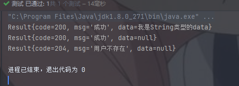

# Java(SpringBoot)后端统一结果返回

github：https://github.com/BDsnake/MyJavaCore/tree/origin/src/main/java/result

## 1.0版本：基础青春版

后端开发过程中，向前端返回的格式应统一确定，所以应当有一个类统一管理返回结果Result（这里用的类是ResultUtil）

下面是构建

首先创建一个Result类

~~~java
public class Result implements Serializable {
    private Integer code;
    private String message;
    private Object data;

    public Result() {
        super();
    }

}
~~~

创建一个常用枚举类，存储自定义的code与message

~~~java
public enum ResultEnum {

    // 这里是自己定义的

    UNKNOWN_ERROR(-1,"未知错误"),
    OK(200,"执行成功"),
    CREATED(201,"新建或修改数据成功"),
    ACCEPTED(202,"请求已经进入后台排队（异步任务）"),
    NO_CONTENT(204,"用户删除数据成功"),
    NO_DATA(205,"请求的资源不存在"),
    INVALID_REQUEST(400,"用户发出的请求有错误，服务器没有进行新建或修改数据的操作"),
    Unauthorized(401,"用户没有权限（令牌、用户名、密码错误）"),
    Forbidden(403,"用户得到授权,但是访问是被禁止的"),
    NOT_FOUND(404,"用户发出的请求针对的是不存在的记录，服务器没有进行操作，该操作是幂等的"),
    Not_Acceptable(406,"用户请求的格式不可得（比如用户请求 JSON 格式，但是只有 XML 格式）"),
    Gone(410,"用户请求的资源被永久删除，且不会再得到"),
    Unprocessable(422,"当创建一个对象时，发生一个验证错误"),
    INTERNAL_SERVER_ERROR(500,"服务器发生错误，用户将无法判断发出的请求是否成功");

    private Integer code;
    private String message;

    ResultEnum(Integer code, String message) {
        this.code = code;
        this.message = message;
    }

    public Integer getCode() {
        return code;
    }

    public String getMessage() {
        return message;
    }

}
~~~

返回类工具

~~~java
public class CommonResult {
    /**成功且带数据**/
    public static Result success(ResultEnum resultEnum,Object object){
        Result result = new Result();
        result.setCode(ResultEnum.OK.getCode());
        result.setMessage(ResultEnum.OK.getMessage());
        result.setData(object);
        return result;
    }

    /**成功但不带数据**/
    public static Result success(ResultEnum resultEnum){
        return success(resultEnum,null);
    }

    /**失败**/
    public static Result error(ResultEnum resultEnum){
        Result result = new Result();
        result.setCode(resultEnum.getCode());
        result.setMessage(resultEnum.getMessage());
        return result;
    }

    /**
     * 自定义参数类型
     * @param code
     * @param msg
     * @return
     */
    public static Result custom(int code, String msg) {
        Result result = new Result();
        result.setCode(code);
        result.setMessage(msg);
        return result;
    }

}
~~~

- 这里的返回类工具提供了四种方法
- 由于成功的情况应该是经常需要用的，而且返回的code和message基本也是固定的，所以直接写两个方法执行比较省心
- 但是错误是有很多种的，所以就传入一个枚举类，直接从枚举类中获取code和message

以下为三种方法对应的使用演示

~~~java
    @Test
    void resTest(){
        //懒得写controller了直接输出吧
        System.out.println(ResultUtil.success(new String("我是String类型的data")));
        System.out.println(ResultUtil.success());
        System.out.println(ResultUtil.error(ResultEnum.USER_NOT_EXIST));
    }
~~~

