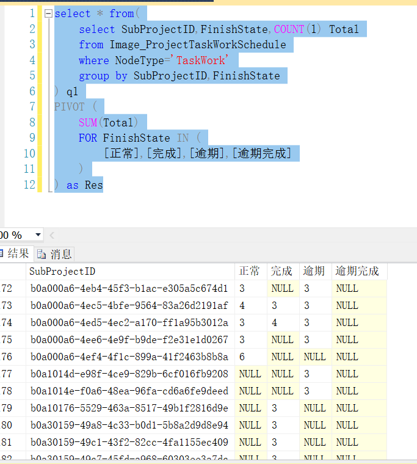

# SQL优化

## 前言

这里不分是哪种数据库，基本是踩到哪的坑就补充哪里的。

## 行转列 PIVOT

SQL Server

~~~sql
select * from(
	select SubProjectID,FinishState,COUNT(1) Total
	from Image_ProjectTaskWorkSchedule
	where NodeType='TaskWork'
	group by SubProjectID,FinishState
) q1
PIVOT (
    SUM(Total)
    FOR FinishState IN (
        [正常],[完成],[逾期],[逾期完成]
    )
) as Res
~~~

这里依据ID和状态groupby，Total是每个ID每个状态下的记录总数

这里想把FinishState行转列，显示出统计的数据Total。按照上面这样写

## UNION 和 UNION ALL

**UNION 和 UNION ALL** 

- 都是将多个查询合并成一个查询结果的关键字
- 都要求字段数量一致，字段类型相似

**UNION**

- 合并多个查询结果集，并去除重复行
- 默认会进行排序，可以使用外部的Order By 指定排序条件
- 以上两点操作会影响查询性能

~~~sql
SELECT column1, column2 FROM table1
UNION
SELECT column1, column2 FROM table2
~~~

**UNION ALL**

- 简单顺序合并多个查询结果集，不会去除重复行，包含所有行
- 与UNION相比性能更好，但要确定是否需要重复行

~~~sql
SELECT column1, column2 FROM table1
UNION ALL
SELECT column1, column2 FROM table2
~~~

**建议**

尽量用UNION ALL 

## (NOT)EXISTS  (NOT)IN 的选择

**结论**

**对于 IN 和 EXISTS**

子查询为大表用 EXISTS  子查询为小表用IN

~~~SQL
--A为小表B为大表用EXISTS
select * from A where exists(select 1 from B where cc=A.cc)  
--A为dB为小表用IN
select * from A where cc in (select cc from B)  
~~~

> in 是把外表和内表作hash 连接，而exists是对外表作loop循环，每次loop循环再对内表进行查询。

**对于 NOT IN 和 NOT EXISTS**

无论哪个表大，都是NOT EXISTS 更快 用NOT EXISTS

> 如果查询语句使用了not in 那么内外表都进行全表扫描，没有用到索引；而not extsts 的子查询依然能用到表上的索引。

**参考：**

https://blog.csdn.net/a657281084/article/details/127281856